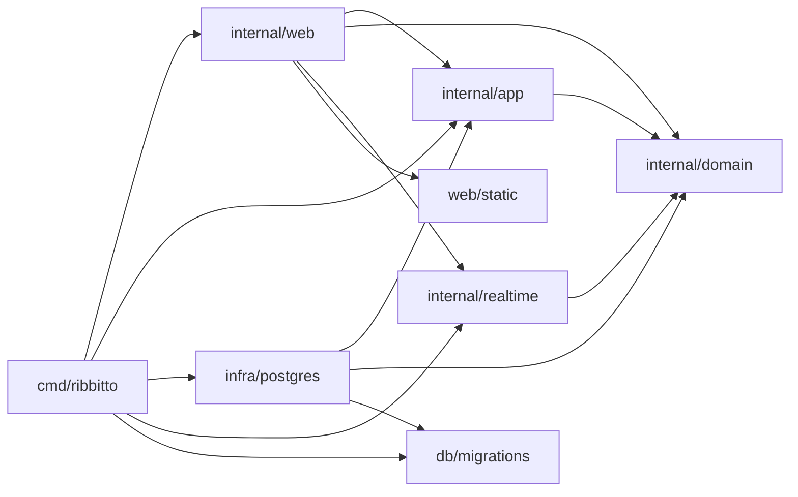
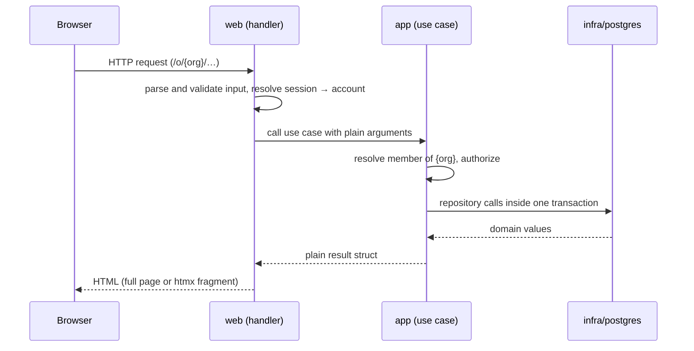
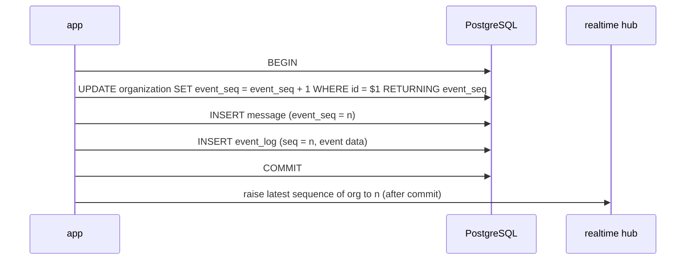

# Architecture

How ribbitto is put together and why. Read this before changing package
boundaries, the request flow or anything real-time.

**Keep it current:** update this file in the same pull request whenever
package responsibilities, allowed imports, the request or data flow, or the
real-time design change. Parts marked *planned* describe agreed designs that
are not implemented yet; move them out of *planned* when they land.

## Packages and allowed imports

One Go binary. `cmd/ribbitto` is the composition root: it reads
configuration, builds the concrete implementations and wires them together.
It is the only package that knows every layer.

| Package | Responsibility | May import from this module |
|---|---|---|
| `internal/domain` | Entities, value types, invariants, domain errors and domain event types. No I/O. | nothing |
| `internal/app` | Use cases, the **only** authorization logic, transaction boundaries. Defines the interfaces it needs (repositories, event publisher). | `domain` |
| `internal/infra/postgres` | PostgreSQL implementations of `app` interfaces, connections, migrations. | `domain`, `app`, `db/migrations` |
| `internal/realtime` | *(planned, M3)* The SSE hub: connections, fan-out, presence. Receives authorization, rendering and event reading as interfaces it defines itself. | `domain` |
| `internal/web` | HTTP routing, handlers, middleware, templ components (`internal/web/view`), the SSE endpoint. The only package that produces HTML. | `domain`, `app`, `realtime`, `web/static` |
| `db/migrations` | Embedded goose SQL migrations. | — |
| `web/static` | Embedded CSS and vendored JavaScript. | — |

Sub-packages of a layer may import each other. depguard in `.golangci.yml`
enforces the part of this table that matters most, and a violating import
fails `make check`:

- each layer's imports **within `internal/`** (other imports from this module
  are listed above by convention, not enforced per layer);
- `db/migrations` may be imported only by `internal/infra/postgres` and
  `cmd/ribbitto` — **this also applies to test files**;
- otherwise test files may import any package.

This section and `.golangci.yml` must agree; change them together.



Why this shape: the domain and the use cases stay testable without a
database or HTTP; authorization lives in exactly one place, so a new
endpoint or a real-time path cannot quietly skip it; and because use cases
return plain structs and only `web` renders HTML, a JSON API can be added
next to the HTML handlers later without touching `app`.

## Request flow *(planned from M1: sessions, members and authorization do not exist yet)*



The organisation always comes from the URL, never from a request body. An
account that is not a member of that organisation gets 404, not 403, so the
existence of an organisation or channel is not revealed.

## Posting a message *(planned, M2–M3)*



- **Take the sequence number first.** The `UPDATE` (scoped to the
  organisation from the URL, `WHERE id = $1`) locks that organisation's row
  until commit, so sequence order equals commit order and no gap can be
  skipped by a reader. A rolled-back transaction also rolls back the
  increment: no holes. The value is needed for `message.event_seq`, hence
  first.
- **The cost** is that durable events of one organisation are serialised on
  that row. Keep these transactions short and always lock the organisation
  first.
- **One sequence, two uses:** the same value goes into `event_log.seq`
  (real-time ordering and replay) and `message.event_seq` (unread counts), so
  unread state still works after old `event_log` rows are deleted.
- **Only durable events go into `event_log`.** Typing indicators and presence
  are ephemeral and never replayed.
- **The hub is told the new sequence after commit.** It keeps, per
  organisation, the highest committed sequence it has seen — a *value*, not
  a one-shot signal (see *No lost wakeups* below) — and only ever raises it.
  Events themselves are always read from `event_log`. A crash between
  commit and telling the hub loses nothing: readers catch up from the table.
  With more than one server, the value travels as PostgreSQL `NOTIFY`
  (payload: organisation and sequence) sent inside the writing transaction;
  each listener raises its local hub's value, and after reconnecting it
  reads `organization.event_seq` and raises the value to that.

## Server-Sent Events *(planned, M3)*

One SSE connection per page, carrying named events (`message`, `presence`,
`typing`, `unread`, `reset`). The browser sends everything else as ordinary
POST requests.

**Ordering and replay**

```mermaid
sequenceDiagram
  participant B as Browser
  participant W as web
  participant DB as PostgreSQL
  participant C as connection goroutine
  B->>W: GET page
  W->>DB: REPEATABLE READ, READ ONLY: page data + event_seq of this organisation
  W-->>B: HTML with cursor = event_seq
  B->>W: GET /events?after=cursor
  W->>C: start
  loop
    C->>DB: event_log WHERE organization_id = org AND seq > cursor ORDER BY seq
    C->>C: authorize, render, send each event; cursor = last seq read
    C->>C: wait until hub's latest sequence of org > cursor (no wait if already)
  end
```

- The initial HTML and the cursor are read in **one `REPEATABLE READ READ
  ONLY` transaction**. Under PostgreSQL's default `READ COMMITTED`, each
  statement sees a new snapshot, so a message committed between reading the
  messages and reading `event_seq` would be missing from the page *and*
  skipped by the stream.
- **No lost wakeups.** Waiting means "block until the hub's latest
  sequence for this organisation is greater than my cursor", and that
  condition is checked under the hub's lock *before* blocking. The hub's
  value is level-triggered: if event 101 is committed after the connection
  read `seq > 100` and found nothing, but before it starts waiting, the hub
  already holds 101, so the wait returns at once and the next read delivers
  it. Wakeups are broadcast (a condition variable, or a channel that is
  closed and replaced on every raise), never a buffered per-connection
  signal that could be dropped. The cursor advances to the last sequence
  *read*, including events this connection may not see, so a filtered event
  cannot keep the loop spinning.
- Replay and live delivery go through the same per-connection loop, so they
  cannot interleave out of order. `Last-Event-ID` is preferred on reconnect;
  before htmx recreates the `EventSource`, the client puts its last cursor
  into `after`. DOM updates are idempotent (elements are replaced by id), so
  a duplicate delivery is harmless.
- A cursor older than the retained `event_log` gets a `reset` event, and the
  client reloads the view.

**Authorization and revocation**

- Every event is authorized for the connection's member **immediately before
  sending**, including events already queued: access may have been lost in
  between. The check itself is `app`'s authorization, reached through the
  `Authorizer` interface that `realtime` defines.
- Logging out or deleting a session cancels that account's connections in
  the hub at once; a timer closes a connection when its session expires.

**Resource limits**

- Each connection has a bounded send queue; a client that does not read is
  disconnected. Every write sets a deadline with
  `http.ResponseController.SetWriteDeadline`, and the server has no global
  `WriteTimeout` (it would cut long-lived streams).
- Middleware that wraps `http.ResponseWriter` implements `Unwrap` so
  flushing works; compression is not applied to the SSE endpoint.
- Heartbeats every 15–30 s keep proxies from closing idle streams. Presence
  waits about 30 s after a disconnect before showing a member as offline, so
  a reload does not flicker.
- On shutdown, SSE connections are closed first (`RegisterOnShutdown`).
  Production serves HTTP/2 through Caddy, because browsers allow only six
  HTTP/1.1 connections per origin.

## Rendering and assets

templ components live in `internal/web/view`. Static assets are embedded
from `web/static` into the binary; the stylesheet URL carries the SHA-256
of the embedded CSS, so assets can be cached as immutable. In development
(`make dev`, `RIBBITTO_DEV_ASSETS=web/static`) assets are read from disk and
the hash is recomputed per request, so rebuilt CSS appears without a
restart. No inline scripts: a strict Content Security Policy can be added
without rework.

**Languages.** `internal/web/i18n` embeds the English and Japanese TOML
catalogues (go-i18n). `cmd/ribbitto` creates one catalogue service for the
process; middleware on HTML routes puts a localizer in the request context.
A valid `lang` cookie wins over `Accept-Language`; the matcher's index picks
a supported catalogue, defaulting to English, and HTML responses add
`Accept-Language` and `Cookie` to `Vary`. Templates get text only through
`i18n.T(ctx, "message.id")` and the page language through `i18n.Language`.
A missing message falls back to English, then to the ID, and is logged once
per language and ID.

## See also

- [`docs/domain.md`](domain.md) — entities, invariants, unread rules
- [`docs/database.md`](database.md) — local database, migrations, tests
- [`docs/schema/README.md`](schema/README.md) — generated reference for the current schema
- [`DECISIONS.md`](../DECISIONS.md) — why things are the way they are
