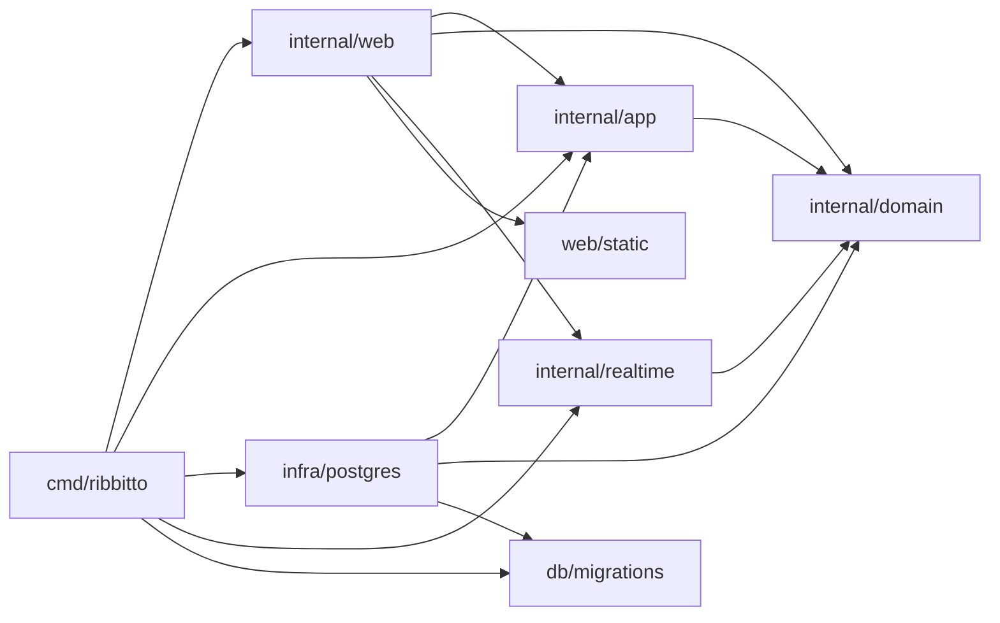
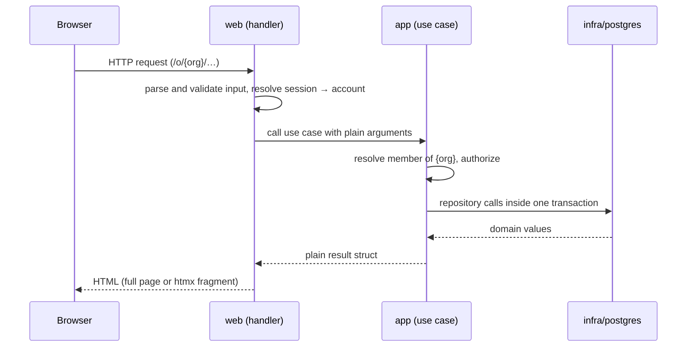
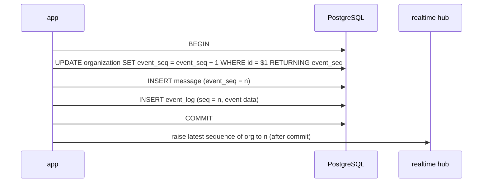

# Architecture

How ribbitto is put together and why. Read this before changing package
boundaries, the request flow or anything real-time.

**Keep it current:** update this file in the same pull request whenever
package responsibilities, allowed imports, the request or data flow, or the
real-time design change. Parts marked *planned* describe agreed designs that
are not implemented yet; move them out of *planned* when they land.

## Packages and allowed imports

One Go binary. `cmd/ribbitto` is the composition root: it reads
configuration, builds the concrete implementations and wires them together.
It is the only package that knows every layer.

| Package | Responsibility | May import from this module |
|---|---|---|
| `internal/domain` | Entities, value types, invariants, domain errors and domain event types. No I/O. | nothing |
| `internal/app` | Use cases, the **only** authorization logic, transaction boundaries. Defines the interfaces it needs (repositories, event publisher). | `domain` |
| `internal/infra/postgres` | PostgreSQL implementations of `app` interfaces, connections, migrations. | `domain`, `app`, `db/migrations` |
| `internal/realtime` | *(planned, M3)* The SSE hub: connections, fan-out, presence. Receives authorization, rendering and event reading as interfaces it defines itself. | `domain` |
| `internal/web` | HTTP routing, handlers, middleware, templ components (`internal/web/view`), the SSE endpoint. The only package that produces HTML. | `domain`, `app`, `realtime`, `web/static` |
| `db/migrations` | Embedded goose SQL migrations. | — |
| `web/static` | Embedded CSS and vendored JavaScript. | — |

Sub-packages of a layer may import each other. depguard in `.golangci.yml`
enforces the part of this table that matters most, and a violating import
fails `make check`:

- each layer's imports **within `internal/`** (other imports from this module
  are listed above by convention, not enforced per layer);
- `domain`, `app`, `infra/postgres` and `realtime` cannot import
  `github.com/a-h/templ` (including sub-packages) or `html/template`;
- `db/migrations` may be imported only by `internal/infra/postgres` and
  `cmd/ribbitto` — **this also applies to test files**;
- otherwise test files may import any package.

This section and `.golangci.yml` must agree; change them together.

`make check` also requires a `doc.go` in every directory under `internal/`
that contains non-test Go files, including generated packages, as specified
in `AGENTS.md`. Fixtures under `testdata/` are excluded.


```mermaid
flowchart LR
  cmd[cmd/ribbitto] --> web & app & postgres[infra/postgres] & realtime & migrations[db/migrations]
  web[internal/web] --> app & domain & realtime & static[web/static]
  postgres --> app & domain & migrations
  realtime[internal/realtime] --> domain
  app[internal/app] --> domain[internal/domain]
```

Why this shape: the domain and the use cases stay testable without a
database or HTTP; authorization lives in exactly one place, so a new
endpoint or a real-time path cannot quietly skip it; and because use cases
return plain structs and only `web` renders HTML, a JSON API can be added
next to the HTML handlers later without touching `app`.

## Request flow *(planned from M1: sessions are wired; member resolution and authorization are not yet)*


```mermaid
sequenceDiagram
  participant B as Browser
  participant W as web (handler)
  participant A as app (use case)
  participant P as infra/postgres
  B->>W: HTTP request (/o/{org}/…)
  W->>W: parse and validate input, resolve session → account
  W->>A: call use case with plain arguments
  A->>A: resolve member of {org}, authorize
  A->>P: repository calls inside one transaction
  P-->>A: domain values
  A-->>W: plain result struct
  W-->>B: HTML (full page or htmx fragment)
```

The organisation always comes from the URL, never from a request body. An
account that is not a member of that organisation gets 404, not 403, so the
existence of an organisation or channel is not revealed.

## First-run setup

`internal/app/setup` checks the configured token and validates all fields
before using the shared `auth.Hasher`. Its store interface requires atomic
creation; `postgres.SetupStore` implements it with one transaction for the
organisation, first sequence, owner account, membership and setup marker.
`cmd/ribbitto` validates `RIBBITTO_SETUP_TOKEN` before opening the database:
empty disables setup, and a non-empty value needs at least 32 characters.
When disabled, `/setup` is not registered at all, so GET and POST are the
router's plain 404, without calling setup or looking up a session. When
enabled, `/setup` is registered outside the session middleware (setup needs
no signed-in account), so whether setup is open is decided first, whatever
the session cookie or the state of the session store.
Otherwise the handler checks `Open` before rendering or accepting a form.
POST calls `Complete` (#31); closed setup (including a concurrent completion)
returns 404, invalid fields or token return 422 without echoing secrets, and
a busy hasher returns 503. Success creates a session for the owner through
`auth.Sessions.Create`, sets the shared session cookie and redirects to `/`
with 303. Setup and sign-in share the process's single password hasher.

## Sessions

`internal/app/auth.Sessions` owns the session lifecycle; `internal/web/middleware`
connects it to HTTP.

- **Create** (at sign-in or setup): 32 random bytes from `crypto/rand` are
  the token, returned once as unpadded base64url for the cookie. Only the
  token's SHA-256 hash is stored, with an absolute expiry 30 days ahead;
  using the session never extends it.
- **Resolve** (every request): the token is decoded strictly, hashed and
  looked up together with its account, only while `expires_at` is after the
  application clock's now. A malformed, unknown, deleted or expired token is
  `auth.ErrNoSession`, meaning signed out; a store error stays an error, so
  a database outage is not mistaken for a sign-out.
- **Delete** (sign-out): the row goes, so the token stops working at once.
- **Clean-up:** `ribbitto serve` deletes expired rows at start and then
  hourly until shutdown. Expired sessions are already rejected; this only
  keeps the table small.

**Signing in** (`auth.SignIn`). The email is normalised and looked up.
An unknown email still runs one Argon2id verification against a dummy hash
made with the current parameters and gets the same `ErrInvalidCredentials`
as a wrong password, which makes timing-based discovery of accounts much
harder. On success the session is **replaced** (`Sessions.Replace`): one
transaction deletes the session named by the token the browser sent (if
any) and inserts the new one, so a token that existed before sign-in never
becomes signed in (session fixation), and a failed sign-in changes nothing
— the browser keeps the session it had. Signing out deletes the session
row.

**Cookie.** The token travels in `__Host-session` with `Path=/`, no
`Domain`, `HttpOnly`, `Secure`, `SameSite=Lax` and a `Max-Age` matching the
session's expiry; `SetSessionCookie` and `ClearSessionCookie` are the only
code that writes it. `Lax` keeps the cookie on top-level navigations (a link
from email or chat), and cross-origin POSTs are stopped separately (below).

**Middleware order** (outermost first):

1. `http.CrossOriginProtection` on every route. It rejects cross-origin
   requests using `Sec-Fetch-Site`, or `Origin` against `Host`, but lets GET,
   HEAD and OPTIONS through — so **every route that changes state is a
   POST**, and GET handlers never change state.
2. `middleware.LimitBody`: every request body is capped at 64 KiB. Reading
   past it fails with `*http.MaxBytesError`, which handlers answer with 413;
   a route that answers without reading the body (a closed route's 404) is
   unaffected.
3. On everything except `/static/` and `/healthz`: security headers
   (below), then i18n.
4. On each **registered** HTML route (the `sessionMux` in `NewHandler`
   wraps routes one by one; `/setup` is the one page registered without
   it): `middleware.Session`. An unknown path or
   method gets its plain 404 or 405 without a session lookup, so it costs
   no query and stays 404 while the database is down. The middleware
   resolves the cookie and puts the account in the context
   (`middleware.Account`). A token that signs nobody in means signed out
   and the cookie is cleared; a store error answers 500 and keeps the
   cookie, so an outage does not sign everyone out. Responses to signed-in
   requests carry `Cache-Control: no-store`.

**Sign-in and sign-out pages** (`internal/web/signin.go`). `GET /signin`
shows the form (a signed-in request is redirected to `/`). `POST /signin`
calls `auth.SignIn` (above) with the cookie the browser sent, so that
session is the one replaced; on success it sets the new cookie and
redirects to `/` with 303. An unknown email and a wrong password get the
same page, status (422) and message; the typed email is kept and the
password never echoed. A busy hasher answers 503. `POST /signout` deletes
the session row, clears the cookie and redirects to `/signin`; there is no
GET sign-out. `cmd/ribbitto` creates the process's one `auth.Hasher` here
and shares it with every authentication use case.

`serve` opens a `pgxpool.Pool` for the sqlc queries; `migrate` keeps using
a `database/sql` handle, which goose needs.

## Posting a message *(planned, M2–M3)*


```mermaid
sequenceDiagram
  participant A as app
  participant DB as PostgreSQL
  participant H as realtime hub
  A->>DB: BEGIN
  A->>DB: UPDATE organization SET event_seq = event_seq + 1 WHERE id = $1 RETURNING event_seq
  A->>DB: INSERT message (event_seq = n)
  A->>DB: INSERT event_log (seq = n, event data)
  A->>DB: COMMIT
  A->>H: raise latest sequence of org to n (after commit)
```

- **Take the sequence number first.** The `UPDATE` (scoped to the
  organisation from the URL, `WHERE id = $1`) locks that organisation's row
  until commit, so sequence order equals commit order and no gap can be
  skipped by a reader. A rolled-back transaction also rolls back the
  increment: no holes. The value is needed for `message.event_seq`, hence
  first.
- **The cost** is that durable events of one organisation are serialised on
  that row. Keep these transactions short and always lock the organisation
  first.
- **One sequence, two uses:** the same value goes into `event_log.seq`
  (real-time ordering and replay) and `message.event_seq` (unread counts), so
  unread state still works after old `event_log` rows are deleted.
- **Only durable events go into `event_log`.** Typing indicators and presence
  are ephemeral and never replayed.
- **The hub is told the new sequence after commit.** It keeps, per
  organisation, the highest committed sequence it has seen — a *value*, not
  a one-shot signal (see *No lost wakeups* below) — and only ever raises it.
  Events themselves are always read from `event_log`. A crash between
  commit and telling the hub loses nothing: readers catch up from the table.
  With more than one server, the value travels as PostgreSQL `NOTIFY`
  (payload: organisation and sequence) sent inside the writing transaction;
  each listener raises its local hub's value, and after reconnecting it
  reads `organization.event_seq` and raises the value to that.

## Server-Sent Events *(planned, M3)*

One SSE connection per page, carrying named events (`message`, `presence`,
`typing`, `unread`, `reset`). The browser sends everything else as ordinary
POST requests.

**Ordering and replay**

```mermaid
sequenceDiagram
  participant B as Browser
  participant W as web
  participant DB as PostgreSQL
  participant C as connection goroutine
  B->>W: GET page
  W->>DB: REPEATABLE READ, READ ONLY: page data + event_seq of this organisation
  W-->>B: HTML with cursor = event_seq
  B->>W: GET /events?after=cursor
  W->>C: start
  loop
    C->>DB: event_log WHERE organization_id = org AND seq > cursor ORDER BY seq
    C->>C: authorize, render, send each event; cursor = last seq read
    C->>C: wait until hub's latest sequence of org > cursor (no wait if already)
  end
```

- The initial HTML and the cursor are read in **one `REPEATABLE READ READ
  ONLY` transaction**. Under PostgreSQL's default `READ COMMITTED`, each
  statement sees a new snapshot, so a message committed between reading the
  messages and reading `event_seq` would be missing from the page *and*
  skipped by the stream.
- **No lost wakeups.** Waiting means "block until the hub's latest
  sequence for this organisation is greater than my cursor", and that
  condition is checked under the hub's lock *before* blocking. The hub's
  value is level-triggered: if event 101 is committed after the connection
  read `seq > 100` and found nothing, but before it starts waiting, the hub
  already holds 101, so the wait returns at once and the next read delivers
  it. Wakeups are broadcast (a condition variable, or a channel that is
  closed and replaced on every raise), never a buffered per-connection
  signal that could be dropped. The cursor advances to the last sequence
  *read*, including events this connection may not see, so a filtered event
  cannot keep the loop spinning.
- Replay and live delivery go through the same per-connection loop, so they
  cannot interleave out of order. `Last-Event-ID` is preferred on reconnect;
  before htmx recreates the `EventSource`, the client puts its last cursor
  into `after`. DOM updates are idempotent (elements are replaced by id), so
  a duplicate delivery is harmless.
- A cursor older than the retained `event_log` gets a `reset` event, and the
  client reloads the view.

**Authorization and revocation**

- Every event is authorized for the connection's member **immediately before
  sending**, including events already queued: access may have been lost in
  between. The check itself is `app`'s authorization, reached through the
  `Authorizer` interface that `realtime` defines.
- Logging out or deleting a session cancels that account's connections in
  the hub at once; a timer closes a connection when its session expires.

**Resource limits**

- Each connection has a bounded send queue; a client that does not read is
  disconnected. Every write sets a deadline with
  `http.ResponseController.SetWriteDeadline`, and the server has no global
  `WriteTimeout` (it would cut long-lived streams).
- Middleware that wraps `http.ResponseWriter` implements `Unwrap` so
  flushing works; compression is not applied to the SSE endpoint.
- Heartbeats every 15–30 s keep proxies from closing idle streams. Presence
  waits about 30 s after a disconnect before showing a member as offline, so
  a reload does not flicker.
- On shutdown, SSE connections are closed first (`RegisterOnShutdown`).
  Production serves HTTP/2 through Caddy, because browsers allow only six
  HTTP/1.1 connections per origin.

## Rendering and assets

templ components live in `internal/web/view`. Static assets are embedded
from `web/static` into the binary; the stylesheet URL carries the SHA-256
of the embedded CSS, so assets can be cached as immutable. In development
(`make dev`, `RIBBITTO_DEV_ASSETS=web/static`) assets are read from disk and
the hash is recomputed per request, so rebuilt CSS appears without a
restart.

**Content Security Policy.** HTML routes are registered on the `pages` mux
in `internal/web.NewHandler`, behind `middleware.SecurityHeaders`. Each
response gets a fresh 32-byte `crypto/rand` nonce, base64-encoded and passed
to templ through `templ.WithNonce`; every script in the shared layout uses
`templ.GetNonce(ctx)`. The policy is defined in one place in
`internal/web/middleware/security.go`:

```text
default-src 'self'; script-src 'nonce-<nonce>'; style-src 'self'; img-src 'self' data:; connect-src 'self'; object-src 'none'; base-uri 'none'; form-action 'self'; frame-ancestors 'none'
```

There is no `'self'` in `script-src`: even same-origin external scripts
require the response's nonce. This is defence in depth against HTML
injection. HTML responses also send `X-Content-Type-Options: nosniff` and
`Referrer-Policy: same-origin`; `/static/` and `/healthz` bypass this
middleware. Caddy owns `Strict-Transport-Security` in deployment.

The layout's `htmx-config` meta tag sets `allowEval: false`,
`allowScriptTags: false` and `includeIndicatorStyles: false`. htmx cannot
evaluate attribute scripts, execute scripts from swapped fragments, or
inject its default inline indicator stylesheet. Do not use inline scripts,
`hx-on`, or other attribute scripts; keep JavaScript and styles in external
assets.

**Languages.** `internal/web/i18n` embeds the English and Japanese TOML
catalogues (go-i18n). `cmd/ribbitto` creates one catalogue service for the
process; middleware on HTML routes puts a localizer in the request context.
A valid `lang` cookie wins over `Accept-Language`; the matcher's index picks
a supported catalogue, defaulting to English, and HTML responses add
`Accept-Language` and `Cookie` to `Vary`. Templates get text only through
`i18n.T(ctx, "message.id")` and the page language through `i18n.Language`.
A missing message falls back to English, then to the ID, and is logged once
per language and ID.

## See also

- [`docs/domain.md`](domain.md) — entities, invariants, unread rules
- [`docs/database.md`](database.md) — local database, migrations, tests
- [`docs/schema/README.md`](schema/README.md) — generated reference for the current schema
- [`DECISIONS.md`](../DECISIONS.md) — why things are the way they are
