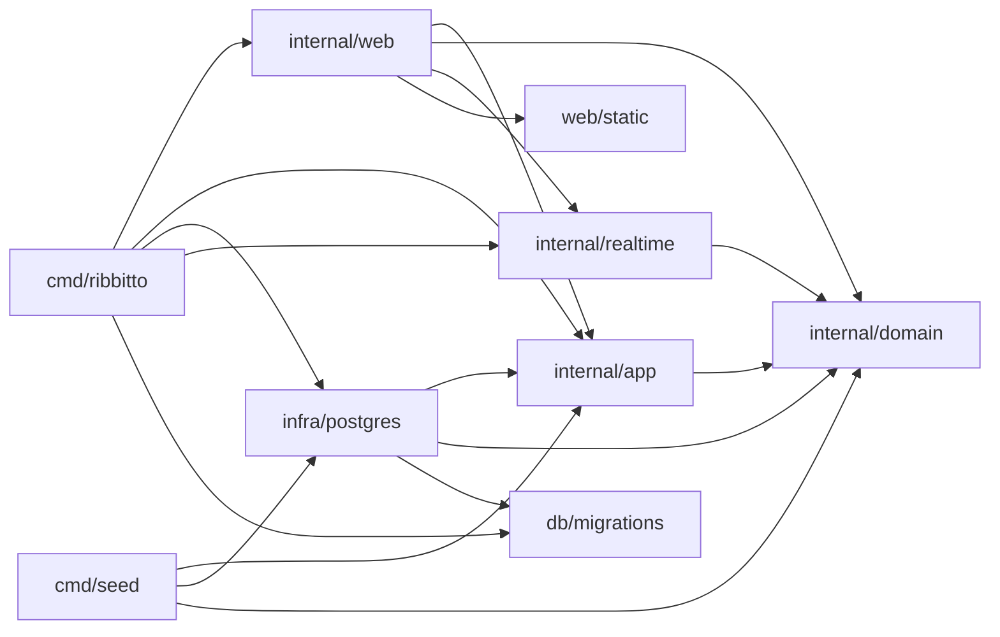

# Architecture

How ribbitto is put together and why. Read this before changing package
boundaries, the request flow or anything real-time.

**Keep it current:** update these files in the same pull request whenever
package responsibilities, allowed imports, the request or data flow, or the
real-time design change. Parts marked *planned* describe agreed designs that
are not implemented yet; move them out of *planned* when they land.

## Packages and allowed imports

`cmd/ribbitto` is the server composition root: it reads configuration,
builds the concrete implementations and wires them together. `cmd/seed` is
a second, development-only composition root: it wires PostgreSQL stores
into setup, sign-up, authorization, channel and posting use cases to create
[synthetic conversations](../database.md#development-seed-data). It never
imports `db/migrations`; the database must already be migrated.

| Package | Responsibility | May import from this module |
|---|---|---|
| `internal/domain` | Entities, value types, invariants, domain errors and domain event types. No I/O. | nothing |
| `internal/app` | Use cases and the **only** authorization logic. Decides what must be atomic; the PostgreSQL adapters open and commit the transactions (see [the feature map](#feature-map)). Defines the interfaces it needs (repositories, event publisher). | `domain` |
| `internal/infra/postgres` | PostgreSQL implementations of `app` interfaces, connections, migrations. | `domain`, `app`, `db/migrations` |
| `internal/realtime` | Real-time delivery (M3): the hub's latest sequences and connection registry, the per-connection delivery loop, shared reads, the watermark check and event retention; presence is planned. Receives authorization, rendering and event reading as interfaces it defines itself. | `domain` |
| `internal/web` | HTTP routing, handlers, middleware, templ components (`internal/web/view`), the SSE endpoint. The only package that produces HTML. | `domain`, `app`, `realtime`, `web/static` |
| `db/migrations` | Embedded goose SQL migrations. | — |
| `web/static` | Embedded CSS, application JavaScript and vendored JavaScript. | — |

Sub-packages of a layer may import each other. depguard in `.golangci.yml`
enforces the part of this table that matters most, and a violating import
fails `make check`:

- each layer's imports **within `internal/`** (other imports from this module
  are listed above by convention, not enforced per layer);
- the `view` rule forbids `internal/web/view` from importing `internal/app`
  or `internal/infra`, including sub-packages (see [web layers](web-layers.md));
- `domain`, `app`, `infra/postgres` and `realtime` cannot import
  `github.com/a-h/templ` (including sub-packages) or `html/template`;
- `db/migrations` may be imported only by `internal/infra/postgres` and
  `cmd/ribbitto` — **this also applies to test files**;
- otherwise test files may import any package.

This section and `.golangci.yml` must agree; change them together.

`make check` also requires a `doc.go` in every directory under `internal/`
that contains non-test Go files, including generated packages, as specified
in `AGENTS.md`. Fixtures under `testdata/` are excluded.

The diagram shows allowed imports; [`docs/dependencies.md`](../dependencies.md) lists the actual ones.

Why this shape: the domain and the use cases stay testable without a
database or HTTP; authorization lives in exactly one place, so a new
endpoint or a real-time path cannot quietly skip it; and because use cases
return plain structs and only `web` renders HTML, a JSON API can be added
next to the HTML handlers later without touching `app`.

`serve` opens a `pgxpool.Pool` for the sqlc queries; `migrate` keeps using
a `database/sql` handle, which goose needs.

## Feature map

The code is layered today, and the direction is a modular monolith by
feature, migrated after M3 ([decision 14](../decisions/14-a-modular-monolith-by-feature-migrated-after-m3.md)).
Until then, new code goes into feature packages inside the layers, and each
feature logically owns tables: only that feature writes them, apart from
the known exceptions below. A feature may own no tables. Every
package-import edge is listed in [`docs/dependencies.md`](../dependencies.md).

| Feature | Packages and files | Owns |
|---|---|---|
| `identity`: accounts, passwords, sessions, signing in, sign-up | `app/auth`, `app/signup`; `infra/postgres` `account.go`, `session.go`, `signup.go`; `web` `signin.go`, `signup.go` | `account`, `session` |
| `org`: organisations, memberships, authorisation, first-run setup | `app/authz`, `app/member`, `app/setup`; `infra/postgres` `authz.go`, `member.go`, `setup.go`; `web` `org.go`, `setup.go` | `organization` (including `event_seq`, `event_log_boundary_seq`), `member`, `setup` |
| `channel`: public conversations | `app/channel`; `domain/channel.go`; `infra/postgres/channel.go`; `db/queries/channel.sql`; `web/channel.go` (channel handlers; the file also serves `message`), `web/view/channel.templ` | `channel` |
| `message`: plain-text posts and history | `app/message`; `domain/message.go`; `infra/postgres/message.go`, `message_reader.go`; `db/queries/message.sql`; `web/channel.go` (history, `?before=` paging, posting), `web/view/channel.templ`, `web/view/message.templ`, `web/static/message-*.js` | `message` |
| `topic`: conversations inside a channel, the default topic, branching *(decision 21; table and store so far)* | `app/topic`; `domain/topic.go`; `infra/postgres/topic.go`; `db/queries/topic.sql` | `topic` |
| `realtime` | `internal/realtime` *(M3)*; `domain/event.go`; `infra/postgres/event_log.go`, `event_reader.go`, `event_cleaner.go`; `db/queries/event_log.sql`; `web/stream.go` (the SSE endpoint), `web/stream_renderer.go` (live renderer and render cache), `web/stream_sender.go` (SSE sender); `web/static/message-stream-v*.js` (SSE glue, shared with `message`) | `event_log` |

The shared kernel, which any feature may use: the IDs and value types in
`internal/domain`, the per-organisation `event_seq` and `event_log_boundary_seq`, and the authorisation
entry point `app/authz`. Other files in `internal/web` (routing, forms,
middleware, views) and the composition roots serve every feature.

`ChannelStore` and `MessageStore` accept a pool or a caller-owned
transaction; `PostingStore` owns the posting transaction (sequence first,
then the message and event). Message references to channels and `org`'s members use
composite foreign keys including `organization_id`. History uses one
newest-first keyset query, `ListMessagesBefore`, with a nullable upper
sequence bound for the latest page, and no author joins. `Reader.One` reads
one message by organisation, channel and `event_seq`, returning `ErrNotFound`
for a missing or out-of-scope message. The use cases
(`app/channel`, `app/message`) exist. `message.Reader` resolves authors through
org's exported `member.Directory.LookupMembers` (member IDs filtered by
organisation, returning handles and account IDs), then identity's
`auth.Directory.LookupDisplayNames` (only those account IDs). Their adapters
own the queries in `member.sql` and `account.sql`; message never queries
those tables. `MessageReader` shares one read-only repeatable-read transaction
across the channel and sidebar (through `channel.Service`), history and both
lookups, plus the shared-kernel `organization.event_seq` on the latest page.
It returns `message.ChannelPage`; older pages have no event cursor.
`MessageReader.One` reads one message and both lookups in its own snapshot.

**Known exceptions.** Cross-feature writes that must commit atomically:

- setup (`org`) writes `organization`, `account`, `member`, `channel` and
  `setup`, so it creates `identity`'s first `account` and the `channel`
  feature's default channel (a completed setup must never lack one);
- sign-up (`identity`) writes `account` and `member` and advances
  `organization.event_seq`, which belong to `org`;
- posting (`message`) advances `organization.event_seq` before inserting
  the message, because the sequence must be taken in the writing
  transaction ([decision 5](../decisions/05-one-event-sequence-per-organisation.md));
- all three flows call realtime's transaction-bound `NewEventLog(tx)` writer
  (`AppendMessagePosted` or `AppendMemberJoined`) immediately after the message
  or member, so `event_log` commits with the entity and its sequence (#156, #257);
- realtime retention (#161) writes org's `event_log_boundary_seq`,
  because the boundary and events must be read in the same snapshot.

Their atomicity and `event_seq` ordering stay as they are. They are
resolved at migration, by an orchestrating module or a shared transaction.
A new exception needs its issue to say why, and is added to this list.

## Index

Read the file for the area you change:

| File | Covers |
|---|---|
| [`request-flow.md`](request-flow.md) | the request flow, organisation routes, server timeouts, middleware order |
| [`setup-and-signup.md`](setup-and-signup.md) | first-run setup and sign-up |
| [`identity.md`](identity.md) | sessions, signing in and out, the session cookie |
| [`rate-limits.md`](rate-limits.md) | authentication rate limits and the reverse-proxy contract |
| [`realtime.md`](realtime.md) | posting a message and the durable event log |
| [`streaming.md`](streaming.md) | Server-Sent Events: ordering and replay, the hub and the loop, authorization and revocation, resource limits |
| [`rendering.md`](rendering.md) | templates, assets, the Content Security Policy, languages |
| [`dev-metrics.md`](dev-metrics.md) | the development-only metrics listener for load tests |
| [`stream-cost.md`](stream-cost.md) | what the delivery loop costs per post as streams grow, and how to measure it |
| [`load-testing.md`](load-testing.md) | what the end-to-end load tests assume about limits, and their dispositions |
| [`web-layers.md`](web-layers.md) | what handlers, templ, htmx and JavaScript are each responsible for, and how it is checked |

## See also

- [`docs/domain/README.md`](../domain/README.md) — glossary and index; [`entities.md`](../domain/entities.md), [`invariants.md`](../domain/invariants.md), [`unread.md`](../domain/unread.md)
- [`docs/domain/names.md`](../domain/names.md) — display names, handles, how members are shown
- [`docs/database.md`](../database.md) — local database, migrations, tests
- [`docs/schema/README.md`](../schema/README.md) — generated reference for the current schema
- [`DECISIONS.md`](../../DECISIONS.md) — why things are the way they are: the index of [`decisions/`](../decisions/)
