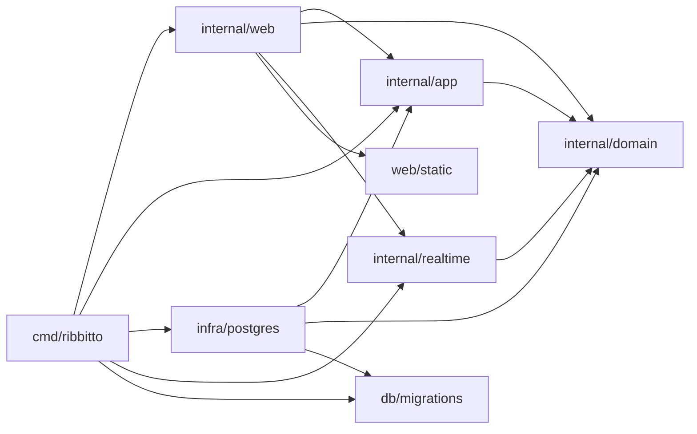

# Architecture

How ribbitto is put together and why. Read this before changing package
boundaries, the request flow or anything real-time.

**Keep it current:** update these files in the same pull request whenever
package responsibilities, allowed imports, the request or data flow, or the
real-time design change. Parts marked *planned* describe agreed designs that
are not implemented yet; move them out of *planned* when they land.

## Packages and allowed imports

One Go binary. `cmd/ribbitto` is the composition root: it reads
configuration, builds the concrete implementations and wires them together.
It is the only package that knows every layer.

| Package | Responsibility | May import from this module |
|---|---|---|
| `internal/domain` | Entities, value types, invariants, domain errors and domain event types. No I/O. | nothing |
| `internal/app` | Use cases, the **only** authorization logic, transaction boundaries. Defines the interfaces it needs (repositories, event publisher). | `domain` |
| `internal/infra/postgres` | PostgreSQL implementations of `app` interfaces, connections, migrations. | `domain`, `app`, `db/migrations` |
| `internal/realtime` | *(planned, M3)* The SSE hub: connections, fan-out, presence. Receives authorization, rendering and event reading as interfaces it defines itself. | `domain` |
| `internal/web` | HTTP routing, handlers, middleware, templ components (`internal/web/view`), the SSE endpoint. The only package that produces HTML. | `domain`, `app`, `realtime`, `web/static` |
| `db/migrations` | Embedded goose SQL migrations. | — |
| `web/static` | Embedded CSS and vendored JavaScript. | — |

Sub-packages of a layer may import each other. depguard in `.golangci.yml`
enforces the part of this table that matters most, and a violating import
fails `make check`:

- each layer's imports **within `internal/`** (other imports from this module
  are listed above by convention, not enforced per layer);
- `domain`, `app`, `infra/postgres` and `realtime` cannot import
  `github.com/a-h/templ` (including sub-packages) or `html/template`;
- `db/migrations` may be imported only by `internal/infra/postgres` and
  `cmd/ribbitto` — **this also applies to test files**;
- otherwise test files may import any package.

This section and `.golangci.yml` must agree; change them together.

`make check` also requires a `doc.go` in every directory under `internal/`
that contains non-test Go files, including generated packages, as specified
in `AGENTS.md`. Fixtures under `testdata/` are excluded.

The diagram shows allowed imports; [`docs/dependencies.md`](../dependencies.md) lists the actual ones.

Why this shape: the domain and the use cases stay testable without a
database or HTTP; authorization lives in exactly one place, so a new
endpoint or a real-time path cannot quietly skip it; and because use cases
return plain structs and only `web` renders HTML, a JSON API can be added
next to the HTML handlers later without touching `app`.

`serve` opens a `pgxpool.Pool` for the sqlc queries; `migrate` keeps using
a `database/sql` handle, which goose needs.

## Feature map

The code is layered today, and the direction is a modular monolith by
feature, migrated after M3 ([`DECISIONS.md`](../../DECISIONS.md), 14).
Until then, new code goes into feature packages inside the layers, and each
feature logically owns tables: only that feature writes them, apart from
the known exceptions below. A feature may own no tables. Every
package-import edge is listed in [`docs/dependencies.md`](../dependencies.md).

| Feature | Packages and files | Owns |
|---|---|---|
| `identity`: accounts, passwords, sessions, signing in, sign-up | `app/auth`, `app/signup`; `infra/postgres` `account.go`, `session.go`, `signup.go`; `web` `signin.go`, `signup.go` | `account`, `session` |
| `org`: organisations, memberships, authorisation, first-run setup | `app/authz`, `app/member`, `app/setup`; `infra/postgres` `authz.go`, `member.go`, `setup.go`; `web` `org.go`, `setup.go` | `organization` (including `event_seq`), `member`, `setup` |
| `channel`, `message` | *(M2)* | *(M2)* |
| `realtime` | `internal/realtime` *(M3)* | none |

The shared kernel, which any feature may use: the IDs and value types in
`internal/domain`, the per-organisation `event_seq`, and the authorisation
entry point `app/authz`. Other files in `internal/web` (routing, forms,
middleware, views) and `cmd/ribbitto` serve every feature.

**Known exceptions.** Two flows write another feature's tables in one
transaction today:

- setup (`org`) writes `organization`, `account`, `member` and `setup`,
  so it creates `identity`'s first `account`;
- sign-up (`identity`) writes `account` and `member` and advances
  `organization.event_seq`, which belong to `org`.

Their atomicity and `event_seq` ordering stay as they are. They are
resolved at migration, by an orchestrating module or a shared transaction.
A new exception needs its issue to say why, and is added to this list.

## Index

Read the file for the area you change:

| File | Covers |
|---|---|
| [`request-flow.md`](request-flow.md) | the request flow, organisation routes, server timeouts, middleware order |
| [`setup-and-signup.md`](setup-and-signup.md) | first-run setup and sign-up |
| [`identity.md`](identity.md) | sessions, signing in and out, the session cookie |
| [`rate-limits.md`](rate-limits.md) | authentication rate limits and the reverse-proxy contract |
| [`realtime.md`](realtime.md) | posting a message and Server-Sent Events (planned) |
| [`rendering.md`](rendering.md) | templates, assets, the Content Security Policy, languages |

## See also

- [`docs/domain.md`](../domain.md) — entities, invariants, unread rules
- [`docs/names.md`](../names.md) — display names, handles, how members are shown
- [`docs/database.md`](../database.md) — local database, migrations, tests
- [`docs/schema/README.md`](../schema/README.md) — generated reference for the current schema
- [`DECISIONS.md`](../../DECISIONS.md) — why things are the way they are
