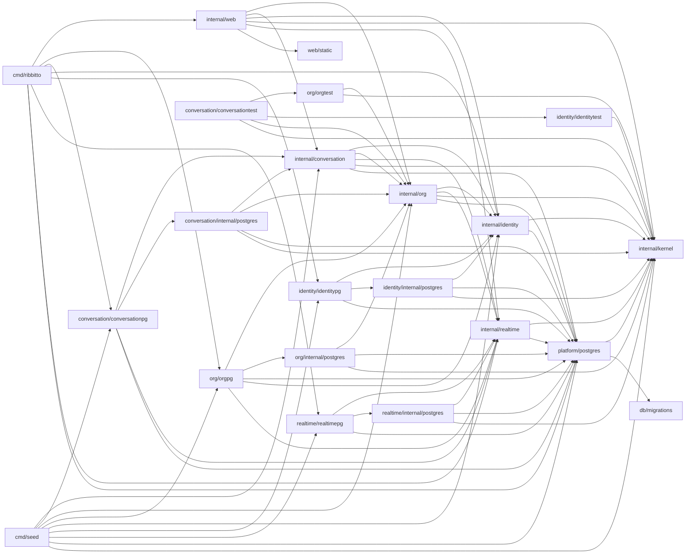

# Packages and allowed imports

Which package does what and which imports are allowed. The [feature map](features.md)
groups these packages by feature; the [architecture index](README.md) lists
the other files.

**Keep it current:** update this file in the same pull request whenever a
package's responsibility or an allowed import changes.

`cmd/ribbitto` is the server composition root: it reads configuration,
builds the concrete implementations and wires them together. `cmd/seed` is
a second, development-only composition root: it wires PostgreSQL stores
into setup, sign-up, authorization, channel, posting and topic branching
use cases to create [synthetic conversations](../seed-data.md), and into sessions,
authorization and history reads for a load run's expected messages. It never
imports `db/migrations`; the database must already be migrated.
`cmd/loadgen` is a development-only HTTP client and run-file comparator; it imports no application
packages. See [load client](load-client.md) for limits and usage.

| Package | Responsibility | May import from this module |
|---|---|---|
| `internal/kernel` | What every module shares and none owns ([decision 26](../decisions/26-modules-by-feature-layout-seams-and-order.md)): `ID` only today. | nothing |
| `internal/platform/postgres` | The pool, the migration connection and runner, statement counting for development metrics, test databases (`pgtest`, which also migrates one to a version), and the opaque `Tx` and `Snapshot` with `InTx` and `InSnapshot`. No feature queries. Its `pgxbridge` unwraps a handle to pgx, for stores only. | `kernel`, `db/migrations` |
| `internal/identity` | The `identity` module's root: accounts, the email, password and display-name rules, password hashing, sessions, signing in and the display-name directory. Its store, `internal/identity/internal/postgres`, runs `db/queries/identity/` on its own `sqlcgen`; its wiring, `identitypg`, builds sessions, sign-in, the snapshot-bound directory (`AccountsIn`) and the transaction-bound account creator (`AccountCreatorIn`). Named functions in the composition roots and web's tests adapt the creator to org's factory and prove that it fits `org.AccountCreator`. See [`internal/identity/doc.go`](../../internal/identity/doc.go) for identifiers. | `kernel`, `platform` |
| `internal/realtime` | The `realtime` module's root, real-time delivery (M3): the hub's latest sequences and connection registry, the per-connection delivery loop, shared reads, the watermark check and event retention; presence is planned. Declares the durable event types. Receives authorization, rendering and org's cursor bounds as interfaces it defines itself. Its store, `internal/realtime/internal/postgres`, reads, appends and expires `event_log` on its own `sqlcgen` (`db/queries/realtime/`), with org's retention lock and boundary injected (`RetentionBoundary`); its wiring, `realtimepg`, builds the reader and the cleaner (`NewCleaner`) and binds the appender to a writer's transaction (`AppenderIn`). See [`internal/realtime/doc.go`](../../internal/realtime/doc.go) for identifiers. | `kernel`, `platform` |
| `internal/org` | The `org` module: organisations, memberships, the **only** authorization logic, name/slug/handle rules and handle changes, the author directory, `member.joined`, event sequence and cursor/retention bounds, first-run setup and sign-up owning their transactions. Its store, `internal/org/internal/postgres`, runs `db/queries/org/` on its own `sqlcgen`; its wiring, `orgpg`, builds use cases and binds stores to callers' transactions or snapshots. See [`internal/org/doc.go`](../../internal/org/doc.go) for identifiers. `orgpg.SequenceIn` serves conversation's posting and branching transactions; `MembersIn` and `EventCursorIn` serve its snapshot. | `kernel`, `platform`, the roots of `identity` and `realtime` |
| `internal/conversation` | The `conversation` module: channels, topics and messages with their rules and errors, the membership-scoped topic lookup, posting and branching owning their transactions, history and the page snapshot owning its snapshot, and the `message.posted` and `messages.moved` kinds it publishes. Owns `channel`, `topic` and `message`. Its store, `internal/conversation/internal/postgres`, runs `db/queries/conversation/` on its own `sqlcgen`; its wiring, `conversationpg`, builds use cases, binds stores to callers' transactions or snapshots and registers its routers. See [`internal/conversation/doc.go`](../../internal/conversation/doc.go) for identifiers. `conversationpg.DefaultChannelCreatorIn` serves setup's transaction. | `kernel`, `platform`, the roots of `identity`, `org` and `realtime` |
| `internal/web` | HTTP routing, handlers, middleware, templ components (`internal/web/view`), the SSE endpoint. The only package that produces HTML. | `kernel`, `identity`, `org`, `conversation`, `realtime`, `web/static` |
| `db/migrations` | Embedded goose SQL migrations. | — |
| `web/static` | Embedded CSS, application JavaScript and vendored JavaScript. | — |

A package's sub-packages may import each other, apart from the store,
wiring and fixture rules. [Modules](modules.md) states the rule for the
test-only fixture packages and [import checks](import-checks.md) how it is
enforced. depguard in `.golangci.yml`
enforces the part of this table that matters most; [import checks](import-checks.md)
lists those rules and the `doc.go` requirement.

The diagram shows allowed imports; [`docs/dependencies.md`](../dependencies.md) lists the actual ones.

Why this shape: the domain and the use cases stay testable without a
database or HTTP; authorization lives in exactly one place, so a new
endpoint or a real-time path cannot quietly skip it; and because use cases
return plain structs and only `web` renders HTML, a JSON API can be added
next to the HTML handlers later without touching the use cases.

`serve` opens a `pgxpool.Pool` for the sqlc queries; `migrate` keeps using
a `database/sql` handle, which goose needs.
