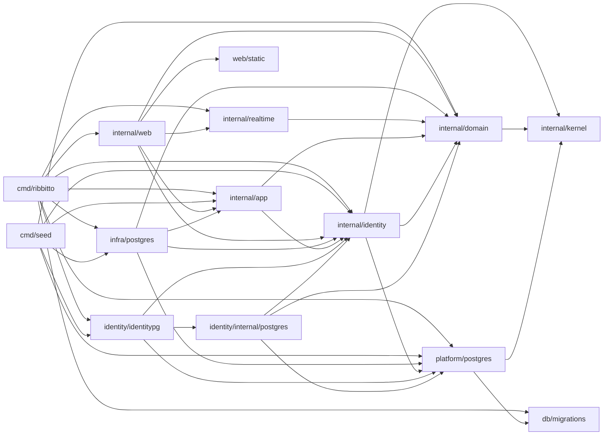

# Packages and allowed imports

Which package does what and which imports are allowed. The [feature map](features.md)
groups these packages by feature; the [architecture index](README.md) lists
the other files.

**Keep it current:** update this file in the same pull request whenever a
package's responsibility or an allowed import changes.

`cmd/ribbitto` is the server composition root: it reads configuration,
builds the concrete implementations and wires them together. `cmd/seed` is
a second, development-only composition root: it wires PostgreSQL stores
into setup, sign-up, authorization, channel, posting and topic branching
use cases to create [synthetic conversations](../seed-data.md). It never
imports `db/migrations`; the database must already be migrated.
`cmd/loadgen` is a development-only HTTP client; it imports no application
packages. See [load client](load-client.md) for limits and usage.

| Package | Responsibility | May import from this module |
|---|---|---|
| `internal/kernel` | What every module shares and none owns ([decision 26](../decisions/26-modules-by-feature-layout-seams-and-order.md)): `ID` only today. | nothing |
| `internal/platform/postgres` | The pool, the migration connection and runner, statement counting for development metrics, test databases (`pgtest`), and the opaque `Tx` and `Snapshot` with `InTx` and `InSnapshot`. No feature queries. Its `pgxbridge` unwraps a handle to pgx, for stores only. | `kernel`, `db/migrations` |
| `internal/domain` | Entities, value types, invariants, domain errors and domain event types. No I/O. `ID` is an alias of `kernel.ID` until the migration's last step. | `kernel` |
| `internal/identity` | The `identity` module's root (step 1a): `Account`, the email and password rules, password hashing, sessions, signing in and the display-name `Directory`, with the store interfaces they need. Its store, `internal/identity/internal/postgres`, runs `db/queries/identity/` on its own `sqlcgen`; its wiring, `identitypg`, builds sessions, sign-in and the snapshot-bound directory (`AccountsIn`). | `kernel`, `platform`; `domain` for the `ID` alias only, until the migration's last step |
| `internal/app` | Use cases and the **only** authorization logic. Decides what must be atomic; the PostgreSQL adapters open and commit the transactions (see [the feature map](features.md)). Defines the interfaces it needs (repositories, event publisher). | `domain`, `identity` |
| `internal/infra/postgres` | PostgreSQL implementations of `app` interfaces. Its `pgtest` keeps the feature fixtures and delegates databases to the platform until the migration's last step. | `domain`, `app`, `identity`, `platform/postgres/pgtest`; until that step also allowed `platform/postgres` and its `pgxbridge` |
| `internal/realtime` | Real-time delivery (M3): the hub's latest sequences and connection registry, the per-connection delivery loop, shared reads, the watermark check and event retention; presence is planned. Receives authorization, rendering and event reading as interfaces it defines itself. | `domain` |
| `internal/web` | HTTP routing, handlers, middleware, templ components (`internal/web/view`), the SSE endpoint. The only package that produces HTML. | `domain`, `app`, `identity`, `realtime`, `web/static` |
| `db/migrations` | Embedded goose SQL migrations. | — |
| `web/static` | Embedded CSS, application JavaScript and vendored JavaScript. | — |

Sub-packages of a layer may import each other. depguard in `.golangci.yml`
enforces the part of this table that matters most, and a violating import
fails `make check`:

- each layer's imports **within `internal/`** (other imports from this module
  are listed above by convention, not enforced per layer);
- the `view` rule forbids `internal/web/view` from importing `internal/app`,
  `internal/identity` or `internal/infra`, including sub-packages (see [web layers](web-layers.md));
- `domain`, `identity`, `app`, `infra/postgres` and `realtime` cannot import
  `github.com/a-h/templ` (including sub-packages) or `html/template`;
- `kernel` imports nothing internal; `platform` only `kernel`; `app`,
  `infra/postgres` and `web` import only a module's root;
- a module's wiring (`identitypg`) is imported only by `cmd/*` and tests,
  and its store only by its wiring and the store's own tests;
- only stores (`**/internal/postgres/**`) import `platform/postgres/pgxbridge`,
  and `internal/infra/postgres` until the migration's last step;
  `make lint-fixtures` (part of `make check`) proves a module root is
  rejected and a store accepted;
- `db/migrations` may be imported only by `internal/platform/postgres` and
  `cmd/ribbitto` — **this also applies to test files**, apart from the
  `internal/infra/postgres` tests that migrate to a target version, until
  their module moves;
- otherwise test files may import any package.

This section and `.golangci.yml` must agree; change them together.

`make check` also requires a `doc.go` in every directory under `internal/`
that contains non-test Go files, including generated packages, as specified
in `AGENTS.md`. Fixtures under `testdata/` are excluded.

The diagram shows allowed imports; [`docs/dependencies.md`](../dependencies.md) lists the actual ones.

Why this shape: the domain and the use cases stay testable without a
database or HTTP; authorization lives in exactly one place, so a new
endpoint or a real-time path cannot quietly skip it; and because use cases
return plain structs and only `web` renders HTML, a JSON API can be added
next to the HTML handlers later without touching `app`.

`serve` opens a `pgxpool.Pool` for the sqlc queries; `migrate` keeps using
a `database/sql` handle, which goose needs.
