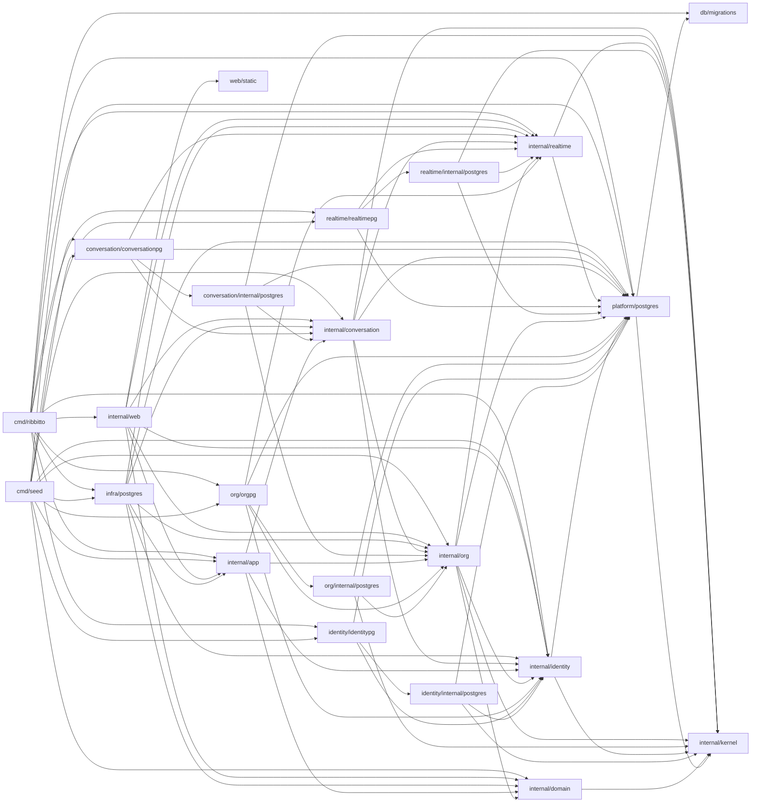

# Packages and allowed imports

Which package does what and which imports are allowed. The [feature map](features.md)
groups these packages by feature; the [architecture index](README.md) lists
the other files.

**Keep it current:** update this file in the same pull request whenever a
package's responsibility or an allowed import changes.

`cmd/ribbitto` is the server composition root: it reads configuration,
builds the concrete implementations and wires them together. `cmd/seed` is
a second, development-only composition root: it wires PostgreSQL stores
into setup, sign-up, authorization, channel, posting and topic branching
use cases to create [synthetic conversations](../seed-data.md). It never
imports `db/migrations`; the database must already be migrated.
`cmd/loadgen` is a development-only HTTP client; it imports no application
packages. See [load client](load-client.md) for limits and usage.

| Package | Responsibility | May import from this module |
|---|---|---|
| `internal/kernel` | What every module shares and none owns ([decision 26](../decisions/26-modules-by-feature-layout-seams-and-order.md)): `ID` only today. | nothing |
| `internal/platform/postgres` | The pool, the migration connection and runner, statement counting for development metrics, test databases (`pgtest`), and the opaque `Tx` and `Snapshot` with `InTx` and `InSnapshot`. No feature queries. Its `pgxbridge` unwraps a handle to pgx, for stores only. | `kernel`, `db/migrations` |
| `internal/domain` | Only the `ID` alias of `kernel.ID` remains until step 5 removes it. Channels, topics, messages and their rules are in `conversation`. | `kernel` |
| `internal/identity` | The `identity` module's root (step 1): `Account`, the email, password and display-name rules, password hashing, sessions, signing in and the display-name `Directory`, with the store interfaces they need. Its store, `internal/identity/internal/postgres`, runs `db/queries/identity/` on its own `sqlcgen`; its wiring, `identitypg`, builds sessions, sign-in, the snapshot-bound directory (`AccountsIn`) and the transaction-bound account creator (`AccountCreatorIn`). Closures in `cmd/*` and the tests adapt the creator to org's factory and prove that it fits `org.AccountCreator`. The root owns `ErrEmailTaken` and `ErrInvalidEmail`. | `kernel`, `platform` |
| `internal/app` | Message and topic use cases. Decides what must be atomic; the PostgreSQL adapters open and commit the transactions (see [the feature map](features.md)). Defines the interfaces it needs (repositories, event publisher). | `domain`, `identity`, `org`; `conversation`'s root until step 4.17 deletes it |
| `internal/infra/postgres` | PostgreSQL implementations of `app` interfaces (conversation's store creates setup's default channel); declares `EventSequence` and its transaction-bound factory for posting and branching, wired from `orgpg.SequenceIn`; its reader takes conversation's member, account and cursor factories. Its `pgtest` keeps the feature fixtures and delegates databases to the platform until the migration's last step. | `domain`, `app`, `identity`, `org`, `platform/postgres/pgtest`; until that step also allowed `platform/postgres` and its `pgxbridge`; until step 4.14 `realtime`'s root (the appender interface), and until 4.16 `conversation`'s (types, errors and payload codecs) |
| `internal/realtime` | Real-time delivery (M3): the hub's latest sequences and connection registry, the per-connection delivery loop, shared reads, the watermark check and event retention; presence is planned. Declares the durable event types (`Event`, `EventKind`, `ErrCursorExpired`). Receives authorization, rendering and org's cursor bounds as interfaces it defines itself. Its store, `internal/realtime/internal/postgres`, reads, appends and expires `event_log` on its own `sqlcgen` (`db/queries/realtime/`), with org's retention lock and boundary injected (`RetentionBoundary`); its wiring, `realtimepg`, builds the reader and the cleaner (`NewCleaner`) and binds the appender to a writer's transaction (`AppenderIn`). The `realtime` module's root since step 2; uses `kernel.ID`. | `kernel`, `platform` |
| `internal/org` | The completed `org` module: organisations, memberships, the **only** authorization logic, name/slug/handle rules and handle changes, the author directory, `member.joined`, event sequence and cursor/retention bounds, first-run setup and sign-up owning their transactions. Its store, `internal/org/internal/postgres`, runs `db/queries/org/` on its own `sqlcgen`; its wiring, `orgpg`, builds use cases and binds stores to callers' transactions or snapshots. See [`internal/org/doc.go`](../../internal/org/doc.go) for identifiers. Until step 4, `orgpg.SequenceIn`, `MembersIn` and `EventCursorIn` are adapted for infra. | `kernel`, `platform`, the roots of `identity` and `realtime`; `domain` only for its `ID` alias, until step 5 |
| `internal/conversation` | The `conversation` module's root, filled in during step 4: `Channel`, its name rule, errors and default name, and `Channels` over its `ChannelStore` interface; `Topic`, its name rule and errors, and `Topics` (the membership-scoped lookup); `Message`, its body rule and errors; the history reader (`Reader` with `Before`, `One` and `Many`, over its `History` and `TopicDirectory` interfaces, returning `Entry`, `Page` and `ChannelPage`); the snapshot-bound member and account directories and cursor it needs (`MemberDirectoryIn`, `AccountDirectoryIn`, `EventCursorIn`); the `TxRunner`, `Writer`, sequence, appender and `Notifier` ports `Posting` uses and branching will use (in production from 4.9c and 4.10a); `Posting` and `NewPosting` (with `Post` and `PostToTopic`), unused in production beside the frozen `app/message.Service` until 4.9c; the `SnapshotRunner` and snapshot-bound `ReadStore` the page snapshot will use (from 4.11c); the `message.posted` and `messages.moved` kinds, payload codecs and routers so far. Its store, `internal/conversation/internal/postgres`, holds channel reads and creation, the topic lookup, posting's and branching's `Writer` and the `ReadStore`'s channel, topic and message reads on its own `sqlcgen` (`db/queries/conversation/`; branching's `CreateTopic` and `MoveMessages` and the page's `ListTopics` and `LookupTopics` are copies of the legacy entry's queries until 4.16, and the message queries (`InsertMessage`, `GetMessage`, `ListMessagesBefore`, `GetMessages`) until 4.15), used by the pool-bound channel use cases, the topic lookup and setup's default channel. Its wiring, `conversationpg`, builds them (`NewChannels`, `NewTopics`, `NewPosting`, the last unused in production until 4.9c), binds the default-channel creator to setup's transaction (`DefaultChannelCreatorIn`), builds the runners and binds the writer and reads (`NewTxRunner`, `WriterIn`, `NewSnapshotRunner`, `ReadStoreIn`), and registers the routers (`EventKinds`). | `kernel`, `platform`, the roots of `identity`, `org` and `realtime` |
| `internal/web` | HTTP routing, handlers, middleware, templ components (`internal/web/view`), the SSE endpoint. The only package that produces HTML. | `domain`, `app`, `identity`, `org`, `conversation`, `realtime`, `web/static` |
| `db/migrations` | Embedded goose SQL migrations. | — |
| `web/static` | Embedded CSS, application JavaScript and vendored JavaScript. | — |

Sub-packages of a layer may import each other. depguard in `.golangci.yml`
enforces the part of this table that matters most; [import checks](import-checks.md)
lists those rules and the `doc.go` requirement.

The diagram shows allowed imports; [`docs/dependencies.md`](../dependencies.md) lists the actual ones.

Why this shape: the domain and the use cases stay testable without a
database or HTTP; authorization lives in exactly one place, so a new
endpoint or a real-time path cannot quietly skip it; and because use cases
return plain structs and only `web` renders HTML, a JSON API can be added
next to the HTML handlers later without touching `app`.

`serve` opens a `pgxpool.Pool` for the sqlc queries; `migrate` keeps using
a `database/sql` handle, which goose needs.
