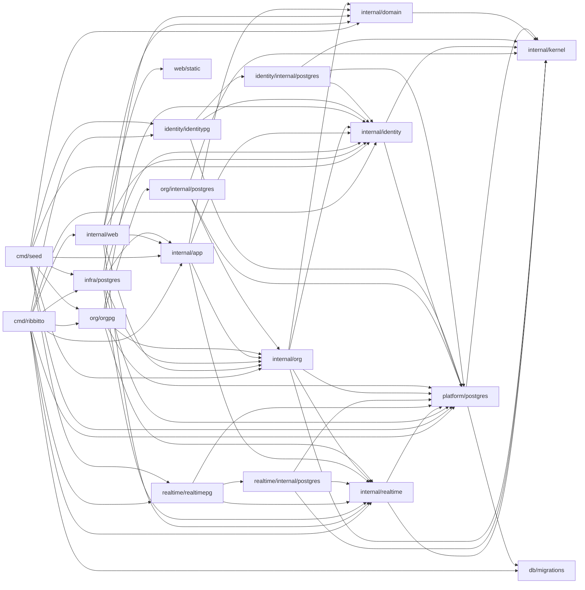

# Packages and allowed imports

Which package does what and which imports are allowed. The [feature map](features.md)
groups these packages by feature; the [architecture index](README.md) lists
the other files.

**Keep it current:** update this file in the same pull request whenever a
package's responsibility or an allowed import changes.

`cmd/ribbitto` is the server composition root: it reads configuration,
builds the concrete implementations and wires them together. `cmd/seed` is
a second, development-only composition root: it wires PostgreSQL stores
into setup, sign-up, authorization, channel, posting and topic branching
use cases to create [synthetic conversations](../seed-data.md). It never
imports `db/migrations`; the database must already be migrated.
`cmd/loadgen` is a development-only HTTP client; it imports no application
packages. See [load client](load-client.md) for limits and usage.

| Package | Responsibility | May import from this module |
|---|---|---|
| `internal/kernel` | What every module shares and none owns ([decision 26](../decisions/26-modules-by-feature-layout-seams-and-order.md)): `ID` only today. | nothing |
| `internal/platform/postgres` | The pool, the migration connection and runner, statement counting for development metrics, test databases (`pgtest`), and the opaque `Tx` and `Snapshot` with `InTx` and `InSnapshot`. No feature queries. Its `pgxbridge` unwraps a handle to pgx, for stores only. | `kernel`, `db/migrations` |
| `internal/domain` | Entities, value types, invariants and domain errors. No I/O. `ID` is an alias of `kernel.ID` until the migration's last step. | `kernel` |
| `internal/identity` | The `identity` module's root (step 1): `Account`, the email, password and display-name rules, password hashing, sessions, signing in and the display-name `Directory`, with the store interfaces they need. Its store, `internal/identity/internal/postgres`, runs `db/queries/identity/` on its own `sqlcgen`; its wiring, `identitypg`, builds sessions, sign-in, the snapshot-bound directory (`AccountsIn`) and the transaction-bound account creator (`AccountCreatorIn`). The root owns `ErrEmailTaken` and `ErrInvalidEmail`. | `kernel`, `platform`; only `identitypg` also imports `org`'s root to implement `org.AccountCreator` |
| `internal/app` | Channel, message and topic use cases. Decides what must be atomic; the PostgreSQL adapters open and commit the transactions (see [the feature map](features.md)). Defines the interfaces it needs (repositories, event publisher). `app/message` and `app/topic` own their event kinds' payload codecs until their module moves. | `domain`, `identity`, `org`; `realtime`'s root for the payload codecs, until step 4, when `conversation` imports it |
| `internal/infra/postgres` | PostgreSQL implementations of `app` and `org` interfaces; declares `MemberDirectory`, `EventCursor` and their snapshot-bound factories for its reader, and `EventSequence` and its transaction-bound factory for posting and branching, wired from `orgpg.MembersIn`, `orgpg.EventCursorIn` and `orgpg.SequenceIn`; `EventKinds` keeps conversation's routers until step 4. Its `pgtest` keeps the feature fixtures and delegates databases to the platform until the migration's last step. | `domain`, `app`, `identity`, `org`, `platform/postgres/pgtest`; until that step also allowed `platform/postgres`, its `pgxbridge` and `realtime`'s root (the event types) |
| `internal/realtime` | Real-time delivery (M3): the hub's latest sequences and connection registry, the per-connection delivery loop, shared reads, the watermark check and event retention; presence is planned. Declares the durable event types (`Event`, `EventKind`, `ErrCursorExpired`). Receives authorization, rendering and org's cursor bounds as interfaces it defines itself. Its store, `internal/realtime/internal/postgres`, reads, appends and expires `event_log` on its own `sqlcgen` (`db/queries/realtime/`), with org's retention lock and boundary injected (`RetentionBoundary`); its wiring, `realtimepg`, builds the reader and the cleaner (`NewCleaner`) and binds the appender to a writer's transaction (`AppenderIn`). The `realtime` module's root since step 2; uses `kernel.ID`. | `kernel`, `platform` |
| `internal/org` | The `org` module's root (step 3, migrating): the **only** authorization logic, `Authorizer` (`Member`, `HomeSlug`, `MayReceive`), `Organization`, `Member`, `Role`, the organisation name, slug and handle rules, `Membership` and the `MembershipStore` it needs, which its own store implements; the handle change (`HandleChanger`), the author `Directory` and the `member.joined` payload (`KindJoined`, `EncodeJoined`, `DecodeJoined`, `RouteJoined`); `AccountCreator` and its `AccountCreatorIn` factory for setup and sign-up; the transaction runner `TxRunner`, the registration writes `RegistrationWriter` with their `RegistrationWriterIn` factory, `SetupState` and `ErrSlugUnavailable`, through which sign-up owns its transaction (setup follows in 3.12); first-run `Setup` (`NewSetup`, `SetupInput`, `SetupResult`, `SetupStore`, `ErrSetupToken`, `ErrSetupCompleted`, `ValidationErrors`), whose transaction stays in `infra/postgres` until 3.12; `SignUp` (`NewSignUp`, `ErrSignUpClosed`, its own `ErrEmailTaken`), whose transaction binds the injected `AccountCreatorIn` and `EventAppenderIn` writers. Both share `ValidationErrors` and account-field validation; sign-up uses the handle change's `ErrHandleTaken`. Its store, `internal/org/internal/postgres`, runs `db/queries/org/` on its own `sqlcgen`: memberships, home slug, handles, the snapshot-bound member directory, the transaction-bound event sequence, registration writes and snapshot-bound page cursor, the setup state, and `realtime`'s cursor bounds, committed sequences and retention lock and boundary, which its wiring, `orgpg`, provides (`NewAuthorizer`, `NewHandleChanger`, `NewSignUp`, `MembersIn`, `SequenceIn`, `NewTxRunner` over the pool with `platform.InTx`, `RegistrationWriterIn`, `NewSetupState`, `EventCursorIn`, `BoundsIn`, `NewSequences`, `RetentionBoundaryIn`); `orgpg.EventKinds` registers org's `RouteJoined` with realtime. | `kernel`, `platform`, the roots of `identity` and `realtime`; `domain` only for its `ID` alias, until step 5 |
| `internal/web` | HTTP routing, handlers, middleware, templ components (`internal/web/view`), the SSE endpoint. The only package that produces HTML. | `domain`, `app`, `identity`, `org`, `realtime`, `web/static` |
| `db/migrations` | Embedded goose SQL migrations. | — |
| `web/static` | Embedded CSS, application JavaScript and vendored JavaScript. | — |

Sub-packages of a layer may import each other. depguard in `.golangci.yml`
enforces the part of this table that matters most, and a violating import
fails `make check`:

- each layer's imports **within `internal/`** (other imports from this module
  are listed above by convention, not enforced per layer);
- the `view` rule forbids `internal/web/view` from importing `internal/app`,
  `internal/identity`, `internal/org` or `internal/infra`, including sub-packages (see [web layers](web-layers.md));
- `domain`, `identity`, `app`, `infra/postgres` and `realtime` cannot import
  `github.com/a-h/templ` (including sub-packages) or `html/template`;
- `kernel` imports nothing internal; `platform` only `kernel`; `app`,
  `infra/postgres` and `web` import a module's root, never its store or
  wiring;
- a module's wiring (`identitypg`, `realtimepg`, `orgpg`) is imported only by `cmd/*` and tests,
  and its store only by its wiring and the store's own tests;
- only stores (`**/internal/postgres/**`) import `platform/postgres/pgxbridge`,
  and `internal/infra/postgres` until the migration's last step;
  `make lint-fixtures` (part of `make check`) proves a module root is
  rejected and a store accepted;
- `db/migrations` may be imported only by `internal/platform/postgres` and
  `cmd/ribbitto` — **this also applies to test files**, apart from the
  three target-version tests in `internal/infra/postgres` and
  `internal/org/internal/postgres/member_handle_test.go`, until step 5;
- otherwise test files may import any package, but the store and bridge
  rules above bind them too (only the platform's `tx_test.go` is exempt from
  the bridge rule).

This section and `.golangci.yml` must agree; change them together.

`make check` also requires a `doc.go` in every directory under `internal/`
that contains non-test Go files, including generated packages, as specified
in `AGENTS.md`. Fixtures under `testdata/` are excluded.

The diagram shows allowed imports; [`docs/dependencies.md`](../dependencies.md) lists the actual ones.

Why this shape: the domain and the use cases stay testable without a
database or HTTP; authorization lives in exactly one place, so a new
endpoint or a real-time path cannot quietly skip it; and because use cases
return plain structs and only `web` renders HTML, a JSON API can be added
next to the HTML handlers later without touching `app`.

`serve` opens a `pgxpool.Pool` for the sqlc queries; `migrate` keeps using
a `database/sql` handle, which goose needs.
