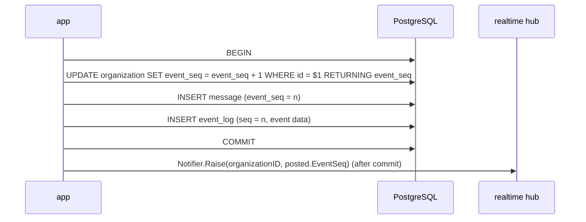

# Posting a message

Durable events and the event log they are written to: [real time](realtime.md#durable-event-log).

`message.Service.Post` validates; `postgres.PostingStore` takes the sequence,
inserts the message, encodes the post with `conversation.EncodePosted` and calls `Append` on the `EventAppender` its store was given for the transaction
in one transaction. Realtime's store appender (`realtimepg.AppenderIn`) owns the event insert, kind-agnostic;
it uses the caller's transaction and already-allocated sequence.
`message.NewWithNotifier` accepts `message.Notifier` (`Raise(organizationID domain.ID, seq int64)`);
`Post` calls it only after the store succeeds. `serve` wires `realtime.Hub`
to it; `message.New` leaves notifications disabled. A channel outside
the caller's organisation fails on the message's composite foreign key and
rolls the sequence back with it.

- **Take the sequence number first.** The `UPDATE` (scoped to the
  organisation from the URL, `WHERE id = $1`) locks that organisation's row
  until commit, so sequence order equals commit order and no gap can be
  skipped by a reader. A rolled-back transaction also rolls back the
  increment: no holes. The value is needed for `message.event_seq`, hence
  first.
- **The cost** is that durable events of one organisation are serialised on
  that row. Keep these transactions short and always lock the organisation
  first.
- **One sequence, two uses:** the same value goes into `event_log.seq`
  (real-time ordering and replay) and `message.event_seq` (unread counts), so
  unread state still works after old `event_log` rows are deleted.
- **Only durable events go into `event_log`.** Typing indicators and presence
  are ephemeral and never replayed.
- **The hub is told the new sequence after commit.** It keeps, per
  organisation, the highest committed sequence it has seen — a *value*, not
  a one-shot signal (see [*No lost wakeups*](replay.md#ordering-and-replay)) — and only ever raises it.
  Events themselves are always read from `event_log`. A crash between
  commit and telling the hub loses nothing: readers catch up from the table.
  *Future work:* with more than one server, the value would travel as PostgreSQL `NOTIFY`
  (payload: organisation and sequence) sent inside the writing transaction;
  each listener would raise its local hub's value, and after reconnecting
  read `organization.event_seq` and raise the value to that (#236).

The channel page reads its channel, sidebar, history and both author batches
in one `REPEATABLE READ READ ONLY` transaction through `postgres.MessageReader`.
The latest page also reads `organization.event_seq` in that snapshot and renders
it as `data-event-cursor` on the outer layout div, outside every htmx swap.
Pages with `?before=` omit the cursor; loading older history or replacing the
composer leaves the initial page cursor intact for #159.
Snapshot composition remains in the adapter until #154 M7.
`MessageReader.One` uses the same snapshot pattern for an event's
organisation, channel and `event_seq`, returning the message with current
author names or `message.ErrNotFound`.

