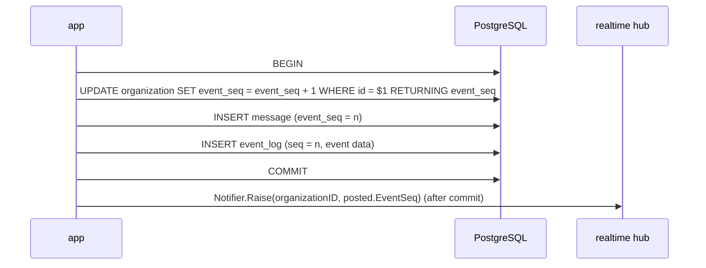

# Messages and real time

## Posting a message

`message.Service.Post` validates; `postgres.PostingStore` takes the sequence,
inserts the message and calls `postgres.NewEventLog(tx).AppendMessagePosted`
in one transaction. Realtime's `EventLog` writer owns the event insert queries;
it uses the caller's transaction and already-allocated sequence.
`message.NewWithNotifier` accepts `message.Notifier` (`Raise(organizationID domain.ID, seq int64)`);
`Post` calls it only after the store succeeds. `serve` wires `realtime.Hub`
to it; `message.New` leaves notifications disabled. A channel outside
the caller's organisation fails on the message's composite foreign key and
rolls the sequence back with it.

- **Take the sequence number first.** The `UPDATE` (scoped to the
  organisation from the URL, `WHERE id = $1`) locks that organisation's row
  until commit, so sequence order equals commit order and no gap can be
  skipped by a reader. A rolled-back transaction also rolls back the
  increment: no holes. The value is needed for `message.event_seq`, hence
  first.
- **The cost** is that durable events of one organisation are serialised on
  that row. Keep these transactions short and always lock the organisation
  first.
- **One sequence, two uses:** the same value goes into `event_log.seq`
  (real-time ordering and replay) and `message.event_seq` (unread counts), so
  unread state still works after old `event_log` rows are deleted.
- **Only durable events go into `event_log`.** Typing indicators and presence
  are ephemeral and never replayed.
- **The hub is told the new sequence after commit.** It keeps, per
  organisation, the highest committed sequence it has seen — a *value*, not
  a one-shot signal (see [*No lost wakeups*](streaming.md#ordering-and-replay)) — and only ever raises it.
  Events themselves are always read from `event_log`. A crash between
  commit and telling the hub loses nothing: readers catch up from the table.
  *Future work:* with more than one server, the value would travel as PostgreSQL `NOTIFY`
  (payload: organisation and sequence) sent inside the writing transaction;
  each listener would raise its local hub's value, and after reconnecting
  read `organization.event_seq` and raise the value to that (#236).

The channel page reads its channel, sidebar, history and both author batches
in one `REPEATABLE READ READ ONLY` transaction through `postgres.MessageReader`.
The latest page also reads `organization.event_seq` in that snapshot and renders
it as `data-event-cursor` on the outer layout div, outside every htmx swap.
Pages with `?before=` omit the cursor; loading older history or replacing the
composer leaves the initial page cursor intact for #159.
Snapshot composition remains in the adapter until #154 M11.
`MessageReader.One` uses the same snapshot pattern for an event's
organisation, channel and `event_seq`, returning the message with current
author names or `message.ErrNotFound`.

## Durable event log

`event_log` is keyed by `(organization_id, seq)`, with `kind`, nullable
`audience_member_id`, IDs-only JSONB `data` and `created_at`. A NULL audience
is organisation-wide; a value restricts delivery to that member, enforced
by the stream's per-event authorization (`authz.MayReceive`). Its composite foreign key keeps the
member in the same organisation. The audience never appears in `data`.
`message.posted` carries `{"channel_id":"<uuid>","message_id":"<uuid>"}`;
`member.joined` carries `{"member_id":"<uuid>"}`; `messages.moved` (branching,
[topics](../domain/topics.md#branching)) carries the channel, the two topics
and the moved message IDs. All use a NULL audience.
Setup and sign-up call `NewEventLog(tx).AppendMemberJoined` immediately after
the member, with its `joined_event_seq`. `domain.Event` holds the envelope and
referenced IDs; kinds are an open list. `postgres.NewEventReader(db)` provides
`EventsAfter(ctx, organizationID, after, limit) ([]domain.Event, error)`:
organisation-scoped rows with `seq > after`, in sequence order, at most `limit`.
It decodes known kinds' IDs, failing the batch for malformed or missing IDs;
unknown kinds retain their envelope with zero IDs for the delivery loop to skip.
The reader satisfies the delivery interface structurally, without
importing `realtime`; authorization remains the connection loop's job.

`organization.event_log_boundary_seq` is the highest sequence no longer in
the log. Migration sets it to each existing organisation's `event_seq`,
without backfilling; new organisations start at 0. Rows above the boundary
are gap-free through `event_seq`; a deferred constraint trigger enforces it at
commit for every writer, including an older binary still running during
`migrate up`. Retention raises the boundary in the same transaction as deletion,
locking one organisation before its events as posting does. The cleaner lists
organisations with expired rows in ID order without write locks, then commits
batches of at most 1,000 expired rows in sequence order until none remain for
each organisation. Each batch reads after acquiring the organisation lock,
so concurrent cleaners see committed progress. Only that organisation's writers
wait; errors or the one-minute run timeout preserve all committed batches for
the next hourly tick. It deletes only rows older than the cutoff; messages,
their sequences and unread positions are untouched.
A cursor is valid from the boundary through the committed `event_seq`,
inclusive, even with an empty log; at `event_seq` it waits for new events.
`EventsAfter` reads both bounds and rows in one SQL statement snapshot, returning
`domain.ErrCursorExpired` outside those bounds, including with a zero limit. Every full
`CachedEvents` result gets a fresh zero-limit check: immutable cached rows and
both bounds describe a valid batch at the check's snapshot, or require reset.
Short batches already carry their read's checks of both bounds. Cached rows
are assumed immutable: a restore happens with ribbitto stopped, so caches and
the hub start empty ([Restoring a backup](../../README.md#restoring-a-backup)).
