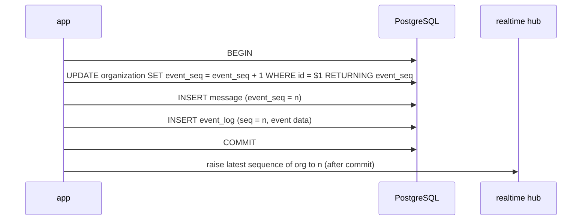

# Messages and real time *(planned, M2–M3)*

## Posting a message *(M2 part implemented; `event_log` and the hub are planned, M3)*



Since M2, `message.Service.Post` (validation) and `postgres.PostingStore`
(the transaction) take the sequence and insert the message; the
`event_log` insert and telling the hub are added in M3. A channel outside
the caller's organisation fails on the message's composite foreign key and
rolls the sequence back with it.

- **Take the sequence number first.** The `UPDATE` (scoped to the
  organisation from the URL, `WHERE id = $1`) locks that organisation's row
  until commit, so sequence order equals commit order and no gap can be
  skipped by a reader. A rolled-back transaction also rolls back the
  increment: no holes. The value is needed for `message.event_seq`, hence
  first.
- **The cost** is that durable events of one organisation are serialised on
  that row. Keep these transactions short and always lock the organisation
  first.
- **One sequence, two uses:** the same value goes into `event_log.seq`
  (real-time ordering and replay) and `message.event_seq` (unread counts), so
  unread state still works after old `event_log` rows are deleted.
- **Only durable events go into `event_log`.** Typing indicators and presence
  are ephemeral and never replayed.
- **The hub is told the new sequence after commit.** It keeps, per
  organisation, the highest committed sequence it has seen — a *value*, not
  a one-shot signal (see *No lost wakeups* below) — and only ever raises it.
  Events themselves are always read from `event_log`. A crash between
  commit and telling the hub loses nothing: readers catch up from the table.
  With more than one server, the value travels as PostgreSQL `NOTIFY`
  (payload: organisation and sequence) sent inside the writing transaction;
  each listener raises its local hub's value, and after reconnecting it
  reads `organization.event_seq` and raises the value to that.

`MessageReader.Before` reads history and both author batches in one
`REPEATABLE READ READ ONLY` transaction. `MessageReader.One` uses the same
snapshot pattern for an event's organisation, channel and `event_seq`,
returning the message with current author names or `message.ErrNotFound`.
The existing channel and sidebar
reads remain outside it; M3 must include those and the cursor in the page
snapshot before enabling SSE.

## Server-Sent Events *(planned, M3)*

One SSE connection per page, carrying named events (`message`, `presence`,
`typing`, `unread`, `reset`). The browser sends everything else as ordinary
POST requests.

### Ordering and replay

```mermaid
sequenceDiagram
  participant B as Browser
  participant W as web
  participant DB as PostgreSQL
  participant C as connection goroutine
  B->>W: GET page
  W->>DB: REPEATABLE READ, READ ONLY: page data + event_seq of this organisation
  W-->>B: HTML with cursor = event_seq
  B->>W: GET /events?after=cursor
  W->>C: start
  loop
    C->>DB: event_log WHERE organization_id = org AND seq > cursor ORDER BY seq
    C->>C: authorize, render, send each event; cursor = last seq read
    C->>C: wait until hub's latest sequence of org > cursor (no wait if already)
  end
```

- The initial HTML and the cursor are read in **one `REPEATABLE READ READ
  ONLY` transaction**. Under PostgreSQL's default `READ COMMITTED`, each
  statement sees a new snapshot, so a message committed between reading the
  messages and reading `event_seq` would be missing from the page *and*
  skipped by the stream.
- **No lost wakeups.** Waiting means "block until the hub's latest
  sequence for this organisation is greater than my cursor", and that
  condition is checked under the hub's lock *before* blocking. The hub's
  value is level-triggered: if event 101 is committed after the connection
  read `seq > 100` and found nothing, but before it starts waiting, the hub
  already holds 101, so the wait returns at once and the next read delivers
  it. Wakeups are broadcast (a condition variable, or a channel that is
  closed and replaced on every raise), never a buffered per-connection
  signal that could be dropped. The cursor advances to the last sequence
  *read*, including events this connection may not see, so a filtered event
  cannot keep the loop spinning.
- Replay and live delivery go through the same per-connection loop, so they
  cannot interleave out of order. `Last-Event-ID` is preferred on reconnect;
  before htmx recreates the `EventSource`, the client puts its last cursor
  into `after`. DOM updates are idempotent (elements are replaced by id), so
  a duplicate delivery is harmless.
- A cursor older than the retained `event_log` gets a `reset` event, and the
  client reloads the view.

### Authorization and revocation

- Every event is authorized for the connection's member **immediately before
  sending**, including events already queued: access may have been lost in
  between. The check itself is `app`'s authorization, reached through the
  `Authorizer` interface that `realtime` defines.
- Logging out or deleting a session cancels that account's connections in
  the hub at once; a timer closes a connection when its session expires.

### Resource limits

- Each connection has a bounded send queue; a client that does not read is
  disconnected. The server's `WriteTimeout` bounds ordinary responses and
  would cut a long-lived stream, so the SSE handler does not inherit it: it
  sets a finite deadline before every write with
  `http.ResponseController.SetWriteDeadline`, which replaces the server's.
  The server's read and idle timeouts stay: they bound reading the request
  and waiting between requests.
- Middleware that wraps `http.ResponseWriter` implements `Unwrap` so
  flushing works; compression is not applied to the SSE endpoint.
- Heartbeats every 15–30 s keep proxies from closing idle streams. Presence
  waits about 30 s after a disconnect before showing a member as offline, so
  a reload does not flicker.
- On shutdown, SSE connections are closed first (`RegisterOnShutdown`).
  Production serves HTTP/2 through Caddy, because browsers allow only six
  HTTP/1.1 connections per origin.
