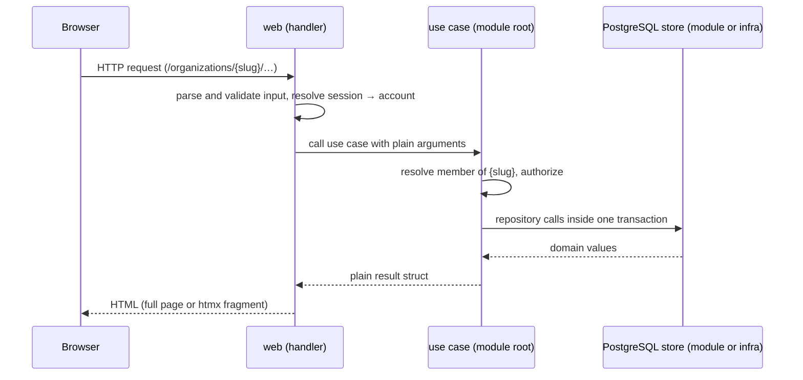

# Request flow

The organisation comes from the URL, never from a request body. Setup
creates it; installation-wide sign-up and `/` resolve it from the setup row,
never from the request. An
account that is not a member of that organisation gets 404, not 403, so the
existence of an organisation or channel is not revealed.

**Organisation routes.** Every page under `/organizations/{slug}/` is listed in
`orgRoutes` (`internal/web/org.go`) and registered by `registerOrgRoutes`,
which calls `org.Authorizer.Member` with the signed-in account and the
slug before the page's handler runs and passes it the resolved membership;
handlers never read `{slug}` themselves. A signed-out request, an unknown
slug, a non-member and a member of another organisation all get the same
404 — a signed-out request is not redirected to sign-in, because a redirect
would reveal which slugs exist. The same list drives
`TestOrgRoutesAgainstPostgreSQL`, so a new route is covered by the 404 tests
as soon as it is added. `GET /` redirects a member of the setup
organisation to its page (`org.Authorizer.HomeSlug`); everyone else sees
the home page.

The channel handlers in `internal/web/channel.go` call `conversation.Channels`
with that membership; they never query the database directly:

| Route | Result |
|---|---|
| `GET /organizations/{slug}/` | 303 to `conversation.Channels.Default`, found by `is_default`; a missing default is logged and answers 500 |
| `GET /organizations/{slug}/channels/{channel-id}` | Channel page and sidebar; malformed, unknown and other organisations' UUIDs answer 404. `?before=<event_seq>` shows the older page; a bound that is not one positive integer, or a malformed query, answers 400 |
| `POST /organizations/{slug}/channels/{channel-id}` | Calls `conversation.Posting.Post`; htmx receives only the reset composer (the message itself arrives over the event stream), otherwise 303 back to the channel; invalid bodies render a field error (422) |
| `GET /organizations/{slug}/channels/{channel-id}/events` | The channel's event stream (SSE); a malformed cursor answers 400, a present `Sec-Fetch-Site` other than a single `same-origin` value 403 (before registration; absent is allowed), a non-member or ended session 404, an account at its stream cap 429, a server shutting down 503. Cancellation before the first write also answers 404 (session ended) or 503 (shutdown) ([streaming](streaming.md); the cap and shutdown: [stream limits](stream-limits.md)) |
| `GET /organizations/{slug}/channels/{channel-id}/topics/{topic-id}/events` | The topic's event stream: the same answers, plus 404 before registration for an unknown topic or another channel's; it sends only that topic's messages |
| `POST /organizations/{slug}/channels` | Creates a channel and answers 303 to its UUID URL; invalid or duplicate names render a field error (422) alongside the default channel |

The creation form inherits the shared CSRF protection and body limit.
Its organisation comes only from the resolved membership. Names are escaped
by templ and never become URL identifiers.

## Server timeouts

In `newServer` (`cmd/ribbitto`):
- 10 s to read the request line and headers.
- 30 s to read a whole request, headers and body. Bodies are capped at 64 KiB.
- 60 s for a keep-alive connection to wait for its next request.
- 60 s to write a response (`WriteTimeout`). `net/http` starts it when the request headers have been read, so it also covers reading the body and running the handler; it is longer than the read limit so a slow but legitimate request still gets its answer.

Without these limits, a client could hold a connection for as long as it liked: idle between requests, with a body started and never finished, or by never reading the response. That includes an unread body that `net/http` discards after a 404 or 429.

**The rule:** ordinary HTTP responses have a bounded write. A streaming endpoint has its own, explicit bounded-write policy instead of the server's: M3's SSE sets a finite deadline before each write (see [`stream-limits.md`](stream-limits.md)). A future route that must read a long request body sets its own read deadline through `http.ResponseController`.

ribbitto keeps these limits itself and does not rely on a reverse proxy for them ([decision 15](../decisions/15-every-ordinary-response-has-a-bounded-write-ribbitto-does-not-rely-on-a-proxy-for-it.md)). A proxy in front (Caddy by default, or nginx, Traefik and others) adds defense in depth: TLS, keeping the backend unreachable from outside, and connection and slow-client limits.

## Middleware order

Outermost first:

1. `http.CrossOriginProtection` on every route. It rejects cross-origin
   requests using `Sec-Fetch-Site`, or `Origin` against `Host`, but lets GET,
   HEAD and OPTIONS through — so **every route that changes state is a
   POST**, and GET handlers never change state.
2. `middleware.LimitBody`: every request body is capped at 64 KiB. Reading
   past it fails with `*http.MaxBytesError`, which handlers answer with 413;
   a route that answers without reading the body (a closed route's 404) is
   unaffected.
3. On everything except `/static/` and `/healthz`: security headers
   ([`rendering.md`](rendering.md#content-security-policy)), then i18n.
4. On each **registered** HTML route (the `sessionMux` in `NewHandler`
   wraps routes one by one; `/setup` and `/signup` are registered without
   it, so their availability is decided first): `middleware.Session`. An unknown path or
   method gets its plain 404 or 405 without a session lookup, so it costs
   no query and stays 404 while the database is down. The middleware
   resolves the cookie and puts the account and the session in the context
   (`middleware.Account`, `middleware.CurrentSession`; streams register
   under the session). A token that signs nobody in means signed out
   and the cookie is cleared; a store error answers 500 and keeps the
   cookie, so an outage does not sign everyone out. Responses to signed-in
   requests carry `Cache-Control: no-store`.
