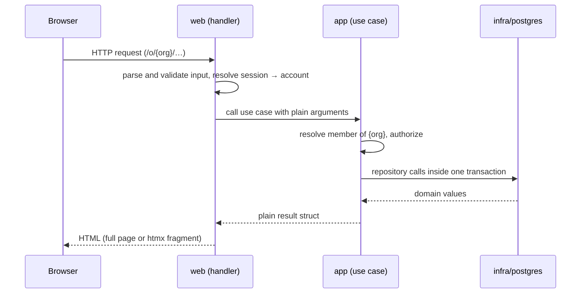

# Request flow

The organisation comes from the URL, never from a request body. Setup
creates it; installation-wide sign-up and `/` resolve it from the setup row,
never from the request. An
account that is not a member of that organisation gets 404, not 403, so the
existence of an organisation or channel is not revealed.

**Organisation routes.** Every page under `/o/{slug}/` is listed in
`orgRoutes` (`internal/web/org.go`) and registered by `registerOrgRoutes`,
which calls `authz.Authorizer.Member` with the signed-in account and the
slug before the page's handler runs and passes it the resolved membership;
handlers never read `{slug}` themselves. A signed-out request, an unknown
slug, a non-member and a member of another organisation all get the same
404 — a signed-out request is not redirected to sign-in, because a redirect
would reveal which slugs exist. The same list drives
`TestOrgRoutesAgainstPostgreSQL`, so a new route is covered by the 404 tests
as soon as it is added. `GET /` redirects a member of the setup
organisation to its page (`authz.Authorizer.HomeSlug`); everyone else sees
the home page.

## Server timeouts

In `newServer` (`cmd/ribbitto`):
- 10 s to read the request line and headers.
- 30 s to read a whole request, headers and body. Bodies are capped at 64 KiB.
- 60 s for a keep-alive connection to wait for its next request.

Without these limits, a client could hold a connection for as long as it liked: idle between requests, or with a body started and never finished. That includes an unread body that `net/http` discards after a 404 or 429.

There is no global `WriteTimeout`; see *Resource limits* in [`realtime.md`](realtime.md#resource-limits). The read and idle limits do not end a response that is still being written. A future route that must read a long request body sets its own read deadline through `http.ResponseController`.

## Middleware order

Outermost first:

1. `http.CrossOriginProtection` on every route. It rejects cross-origin
   requests using `Sec-Fetch-Site`, or `Origin` against `Host`, but lets GET,
   HEAD and OPTIONS through — so **every route that changes state is a
   POST**, and GET handlers never change state.
2. `middleware.LimitBody`: every request body is capped at 64 KiB. Reading
   past it fails with `*http.MaxBytesError`, which handlers answer with 413;
   a route that answers without reading the body (a closed route's 404) is
   unaffected.
3. On everything except `/static/` and `/healthz`: security headers
   ([`rendering.md`](rendering.md#content-security-policy)), then i18n.
4. On each **registered** HTML route (the `sessionMux` in `NewHandler`
   wraps routes one by one; `/setup` and `/signup` are registered without
   it, so their availability is decided first): `middleware.Session`. An unknown path or
   method gets its plain 404 or 405 without a session lookup, so it costs
   no query and stays 404 while the database is down. The middleware
   resolves the cookie and puts the account in the context
   (`middleware.Account`). A token that signs nobody in means signed out
   and the cookie is cleared; a store error answers 500 and keeps the
   cookie, so an outage does not sign everyone out. Responses to signed-in
   requests carry `Cache-Control: no-store`.
