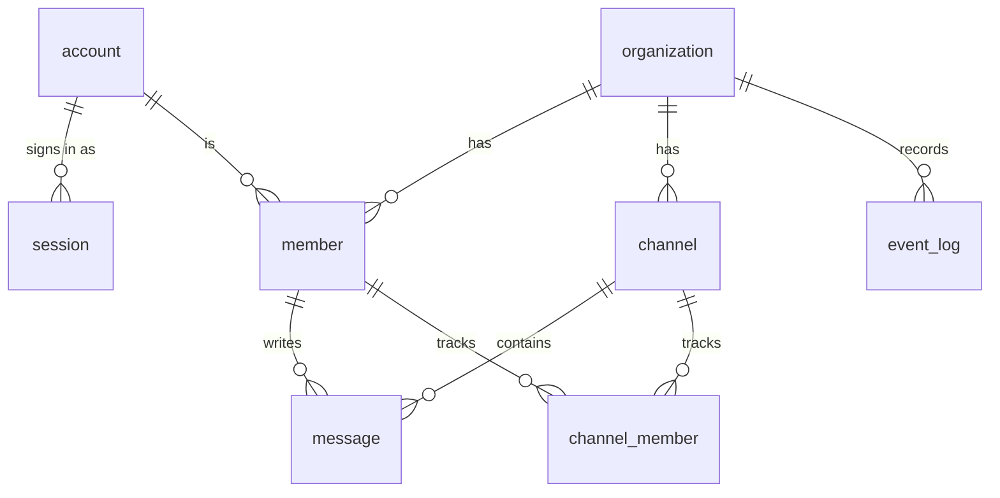

# Domain

The words ribbitto uses, the things it stores and the rules that must always
hold. Code identifiers use the terms in the glossary; the frog-themed product
words (ribbit, pond, marsh, …) appear only in UI message files.

**Keep it current:** update this file in the same pull request whenever a
term, an entity, a relation, an invariant or the unread rules change.
Entities marked *planned* do not have tables yet; `db/migrations/` is the
source of truth for what exists.

## Glossary

| Term | Meaning |
|---|---|
| **account** | A person who can sign in. Global, not tied to one organisation. |
| **session** | A signed-in browser of an account. |
| **organization** | A workspace. Owns everything its members create. |
| **member** | An account's membership in one organisation. All organisation-owned data refers to members, never directly to accounts. |
| **channel** | A named conversation inside an organisation. |
| **channel member** | A member's per-channel state (read position). |
| **message** | A post in a channel, written by a member. |
| **event** | A durable change that live clients must see (a message posted, a member joined), recorded in `event_log`. |
| **event sequence** (`event_seq`) | The organisation's single, gap-free, increasing counter. Every durable event gets the next value. |
| **cursor** | The last event sequence a client has seen. |

## Entities



| Entity | Status | Key columns |
|---|---|---|
| `organization` | exists | `id` (UUIDv7), `slug` (1–63 chars, `a-z0-9-`, no leading or trailing `-`), `name`, `event_seq` |
| `account` | planned (M1) | email, Argon2id password hash |
| `session` | planned (M1) | SHA-256 hash of the session token, expiry |
| `member` | planned (M1) | `organization_id`, `account_id`, role (`owner` or `member`), `joined_event_seq` |
| `channel` | planned (M2) | `organization_id`, name |
| `channel_member` | planned (M2) | `organization_id`, `channel_id`, `member_id`, `last_read_event_seq` |
| `message` | planned (M2) | `organization_id`, `channel_id`, `member_id`, body, `event_seq` |
| `event_log` | planned (M3) | `organization_id`, `seq`, event data; old rows deleted after a retention period |

All ids are UUIDv7, generated by PostgreSQL's `uuidv7()`, so they sort by
creation time.

## Invariants

1. **Everything an organisation owns carries `organization_id`**, and every
   query on it filters by `organization_id` — including simple examples in
   documentation.
2. **References inside an organisation are composite foreign keys that
   include `organization_id`**, so a row can never point at another
   organisation's data even if an id is guessed.
3. **Organisation-owned data refers to `member`, never to `account`.**
4. **The organisation comes from the URL** (`/o/{slug}/…`), never from a
   request body. An account that is not a member gets **404**.
5. **Authorization is decided only in `internal/app`.** Handlers and the
   real-time hub call it; they never re-implement it.
6. **`organization.event_seq` only increases, without gaps.** It is taken
   first in the writing transaction, and the same value is stored in both
   `event_log.seq` and the entity's own `event_seq` (for messages).
7. **Session tokens are never stored.** Only their SHA-256 hash is; passwords
   are stored only as Argon2id hashes.

These are **requirements for all code and migrations**, not a description
of what is implemented today: only `organization` exists so far, and
membership, sessions and authorization arrive in M1. Every migration that
adds an organisation-owned table must include `organization_id` and
composite foreign keys (1–3), and every use case must be covered by tests
for 4–5 as it is written. Row-level security in PostgreSQL is planned as a
second line of defence after the MVP.

## Unread rules *(planned, M2–M4)*

- **Read position** of a member in a channel is
  `channel_member.last_read_event_seq` if the row exists, otherwise
  `member.joined_event_seq`. So messages from before a member joined are
  never unread, and a channel the member has never opened needs no row.
- **Unread count**:
  ```sql
  SELECT count(*) FROM message
  WHERE organization_id = $1 AND channel_id = $2 AND event_seq > $3;  -- $3 = read position
  ```
  backed by an index on `message (organization_id, channel_id, event_seq)`.
- **Joining an organisation is one transaction:** take the next
  `event_seq`, insert the `member` with `joined_event_seq` = that value, and
  insert the `event_log` row.
- **Opening a channel for the first time** creates the `channel_member` row
  with `last_read_event_seq` = the **cursor of the snapshot that rendered the
  page**, not the latest sequence at insert time — otherwise messages
  posted after the page was read, and not yet shown, would be marked read.
- **The read position never moves backwards.** Several tabs or reordered
  requests must not lower it:
  ```sql
  INSERT INTO channel_member (organization_id, channel_id, member_id, last_read_event_seq)
  VALUES ($1, $2, $3, $4)
  ON CONFLICT (organization_id, channel_id, member_id) DO UPDATE
    SET last_read_event_seq = GREATEST(channel_member.last_read_event_seq, EXCLUDED.last_read_event_seq);
  ```

## MVP scope

One organisation, created by a first-run setup that needs a setup token and
succeeds only once. Sign-up can be switched on; new accounts then join that
organisation as members. Two roles: `owner` and `member`. Public channels
only: every member can read and write them.

Later, in roughly this order: private channels, direct messages,
invitations, reactions, editing and deleting, row-level security, several
organisations (see [`docs/roadmap.md`](roadmap.md)).
