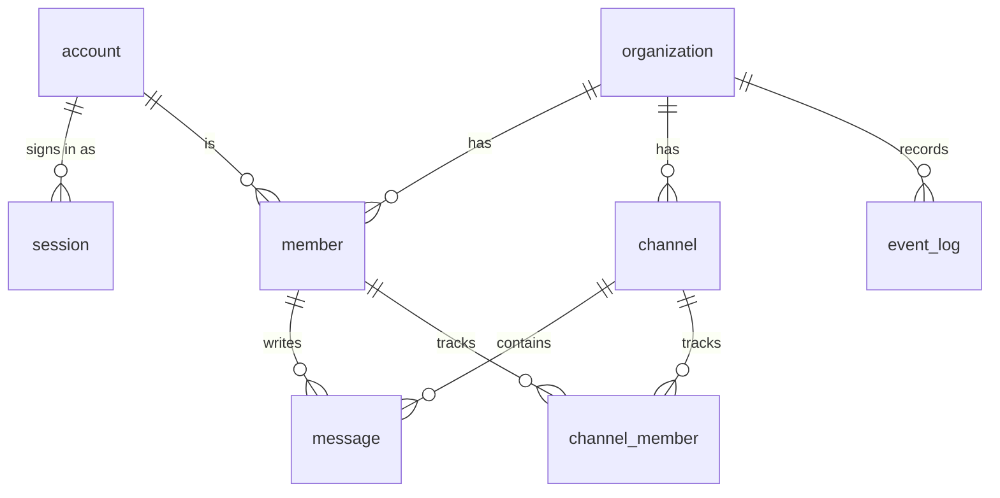

# Domain

The words ribbitto uses, the things it stores and the rules that must always
hold. Code identifiers use the terms in the glossary; the frog-themed product
words (ribbit, pond, marsh, …) appear only in UI message files.

**Keep it current:** update this file in the same pull request whenever a
term, an entity, a relation, an invariant or the unread rules change.
Entities marked *planned* do not have tables yet; `db/migrations/` is the
source of truth for what exists. See the [generated schema reference](schema/README.md)
for the current tables, columns and constraints.

## Glossary

| Term | Meaning |
|---|---|
| **account** | A person who can sign in. Global, not tied to one organisation. |
| **session** | A signed-in browser of an account. |
| **organization** | A workspace. Owns everything its members create. |
| **member** | An account's membership in one organisation. All organisation-owned data refers to members, never directly to accounts. |
| **handle** | A member's organisation-scoped name for people to tell members apart, shown as `Display name @handle`. |
| **channel** | A named conversation inside an organisation. |
| **channel member** | A member's per-channel state (read position). |
| **message** | A post in a channel, written by a member. |
| **event** | A durable change that live clients must see (a message posted, a member joined), recorded in `event_log`. |
| **event sequence** (`event_seq`) | The organisation's single, gap-free, increasing counter. Every durable event gets the next value. |
| **cursor** | The last event sequence a client has seen. |

## Entities


```mermaid
erDiagram
  account ||--o{ session : "signs in as"
  account ||--o{ member : "is"
  organization ||--o{ member : "has"
  organization ||--o{ channel : "has"
  organization ||--o{ event_log : "records"
  channel ||--o{ message : "contains"
  member ||--o{ message : "writes"
  channel ||--o{ channel_member : "tracks"
  member ||--o{ channel_member : "tracks"
```

| Entity | Status | Key columns |
|---|---|---|
| `organization` | exists | `id` (UUIDv7), `slug` (1–63 chars, `a-z0-9-`, no leading or trailing `-`), `name`, `event_seq` |
| `account` | exists | normalised unique email, display name, Argon2id password hash |
| `session` | exists | SHA-256 hash of the session token, expiry |
| `setup` | exists | boolean key fixed to `true`, `organization_id`, `completed_at` |
| `member` | exists | `organization_id`, `account_id`, role (`owner` or `member`), `joined_event_seq`, `handle` (unique per organisation) |
| `channel` | planned (M2) | `organization_id`, name |
| `channel_member` | planned (M2) | `organization_id`, `channel_id`, `member_id`, `last_read_event_seq` |
| `message` | planned (M2) | `organization_id`, `channel_id`, `member_id`, body, `event_seq` |
| `event_log` | planned (M3) | `organization_id`, `seq`, event data; old rows deleted after a retention period |

Except for the singleton setup key, all ids are UUIDv7, generated by
PostgreSQL's `uuidv7()`, so they sort by creation time.

## Validation

`internal/domain` validates M1 form values. Text must be valid UTF-8.
Email, display name and organisation name are trimmed and normalised to Unicode
NFC; email is also lower-cased before NFC normalisation, storage and lookup.
Lengths count Unicode code points after normalisation, except email (bytes) and
slug (ASCII). Controls, including NUL, are rejected before trimming. After
trimming, these fields accept only printable characters (`unicode.IsPrint`),
rejecting format characters such as zero-width spaces, RTL overrides, BOMs and
soft hyphens, and line/paragraph separators. Names allow ASCII spaces and the ideographic space
(U+3000, common in Japanese names) only; email rejects all spaces. The database also requires account email and display
name to be NFC.

- **Email:** exactly one `@`, nonempty parts on both sides, at most 254 bytes
  after normalisation.
- **Display name:** 1–50 characters after normalisation, not blank-looking
  ([`names.md`](names.md#display-names)).
- **Password:** 15–128 characters, preserved as entered, no composition rules.
- **Organisation name:** 1–100 characters after normalisation.
- **Slug:** 1–63 characters from `a-z0-9-`, no leading or trailing `-`.
- **Handle:** 2–32 ASCII characters, unique per organisation ignoring case
  ([`names.md`](names.md#handles)).

Sessions store a unique 32-byte token hash and expire after their creation.
Deleting an account cascades to sessions. Membership references restrict
account and organisation deletion; membership is unique per organisation and
account, and `joined_event_seq` starts at 1.

**Names and identity.** Display names and handles are for people only;
**`member_id`** is the only identifier the system trusts, for permissions,
mentions and stored references. See [`names.md`](names.md).

## Invariants

1. **Everything an organisation owns carries `organization_id`**, and every
   query on it filters by `organization_id` — including simple examples in
   documentation.
2. **References inside an organisation are composite foreign keys that
   include `organization_id`**, so a row can never point at another
   organisation's data even if an id is guessed.
3. **Organisation-owned data refers to `member`, never to `account`.**
4. **The organisation comes from the URL** (`/organizations/{slug}/…`), never
   from a request body. Setup creates the organisation; installation-wide sign-up
   and `/` resolve it from the setup row, never from the request. An account
   that is not a member gets **404**. Enforced by `registerOrgRoutes` in
   `internal/web/org.go`.
5. **Authorization is decided only in `internal/app`.** Handlers and the
   real-time hub call it; they never re-implement it. The entry point is
   `internal/app/authz`: `Authorizer.Member` turns the signed-in account and
   the slug from the URL into a membership, with one not-found error for an
   unknown slug, a non-member and a signed-out caller.
6. **`organization.event_seq` only increases, without gaps.** It is taken
   first in the writing transaction, and the same value is stored in both
   `event_log.seq` and the entity's own `event_seq` (for messages).
7. **Session tokens are never stored.** Only their SHA-256 hash is; passwords
   are stored only as Argon2id hashes.
8. **An email address proves nothing about who owns an account.** M1 does
   not verify email addresses, so anyone can create an account with someone
   else's address. Therefore:
   - an unverified address is never evidence of identity, neither for
     linking an external identity (OIDC, SAML, SCIM) to an account nor for
     granting a membership (in M1, memberships come only from setup and
     sign-up);
   - an external identity is never linked to an existing account because
     the email addresses match.

   Sign-up's duplicate-email response is an accepted trade-off
   ([`DECISIONS.md`](../DECISIONS.md) 13).

These are **requirements for all code and migrations**, not a description
of what is implemented today: `organization`, `account`, `session`,
`member` and `setup` have tables; setup authorization is implemented, and
organisation routes go through `internal/app/authz`. Every migration that adds an
organisation-owned table must include `organization_id` and
composite foreign keys (1–3), and every use case must be covered by tests
for 4–5 as it is written. Row-level security in PostgreSQL is planned as a
second line of defence after the MVP.

## Unread rules *(planned, M2–M4)*

- **Read position** of a member in a channel is
  `channel_member.last_read_event_seq` if the row exists, otherwise
  `member.joined_event_seq`. So messages from before a member joined are
  never unread, and a channel the member has never opened needs no row.
- **Unread count**:
  ```sql
  SELECT count(*) FROM message
  WHERE organization_id = $1 AND channel_id = $2 AND event_seq > $3;  -- $3 = read position
  ```
  backed by an index on `message (organization_id, channel_id, event_seq)`.
- **Joining an organisation is one transaction:** take the next
  `event_seq`, insert the `member` with `joined_event_seq` = that value, and
  insert the `event_log` row. Until M3 adds `event_log`, joining takes the
  next `event_seq` but writes no `event_log` row.
- **Opening a channel for the first time** creates the `channel_member` row
  with `last_read_event_seq` = the **cursor of the snapshot that rendered the
  page**, not the latest sequence at insert time — otherwise messages
  posted after the page was read, and not yet shown, would be marked read.
- **The read position never moves backwards.** Several tabs or reordered
  requests must not lower it:
  ```sql
  INSERT INTO channel_member (organization_id, channel_id, member_id, last_read_event_seq)
  VALUES ($1, $2, $3, $4)
  ON CONFLICT (organization_id, channel_id, member_id) DO UPDATE
    SET last_read_event_seq = GREATEST(channel_member.last_read_event_seq, EXCLUDED.last_read_event_seq);
  ```

## First-run setup

`setup` is installation-wide state, read without an organisation filter.
Its `organization_id` only names the organisation setup created; it does
not make the row organisation-owned. Its primary key is a boolean fixed to
`true`, not a UUIDv7. Completion stays recorded even if other organisations
are created later.

A nonempty configured setup token authorizes setup: SHA-256 hashes of the
configured and submitted tokens are compared in constant time. All fields
are validated before password hashing. One transaction inserts the
organisation, takes its next `event_seq` (1), creates the account with an
Argon2id hash and its owner membership at that sequence, then inserts the
setup row. The singleton key rejects concurrent losers and their whole
transactions roll back. Repeated setup returns 404.

## MVP scope

One organisation, created by a first-run setup that needs a setup token and
succeeds only once. `RIBBITTO_SIGNUP=on` opens sign-up after setup; new
accounts join the setup row's organisation as members. `off`, empty or unset disables sign-up
(GET and POST `/signup` return 404); any other value prevents startup.
Two roles: `owner` and `member`. Public channels only: every member can read and write them.

Later, in roughly this order: private channels, direct messages,
invitations, reactions, editing and deleting, row-level security, several
organisations (see [`docs/roadmap.md`](roadmap.md)).
