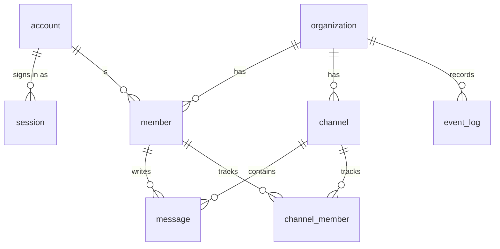

# Domain

The words ribbitto uses, the things it stores and the rules that must always
hold. Code identifiers use the terms in the glossary; the frog-themed product
words (ribbit, pond, marsh, …) appear only in UI message files.

**Keep it current:** update this file in the same pull request whenever a
term, an entity, a relation, an invariant or the unread rules change.
Entities marked *planned* do not have tables yet; `db/migrations/` is the
source of truth for what exists. See the [generated schema reference](../schema/README.md)
for the current tables, columns and constraints.

## Index

| File | Covers |
|---|---|
| `README.md` (this file) | glossary, entities and ER diagram, invariants, MVP scope |
| [`validation.md`](validation.md) | input validation rules |
| [`unread.md`](unread.md) | unread rules (planned, M2–M4) |
| [`names.md`](names.md) | display names, handles, how members are shown |
| [`channels.md`](channels.md) | channel identity, names and the default channel |
| [`messages.md`](messages.md) | message identity, accepted bodies and rendering |
| [`setup-and-signup.md`](../architecture/setup-and-signup.md) | first-run setup and sign-up |

## Glossary

| Term | Meaning |
|---|---|
| **account** | A person who can sign in. Global, not tied to one organisation. |
| **session** | A signed-in browser of an account. |
| **organization** | A workspace. Owns everything its members create. |
| **member** | An account's membership in one organisation. All organisation-owned data refers to members, never directly to accounts. |
| **handle** | A member's organisation-scoped name for people to tell members apart, shown as `Display name @handle`. |
| **channel** | A named conversation inside an organisation. |
| **channel member** | A member's per-channel state (read position). |
| **message** | A post in a channel, written by a member. |
| **event** | A durable change that live clients must see (a message posted, a member joined), recorded in `event_log`. |
| **event sequence** (`event_seq`) | The organisation's single, gap-free, increasing counter. Every durable event gets the next value. |
| **cursor** | The last event sequence a client has seen. |

## Entities

| Entity | Status | Key columns |
|---|---|---|
| `organization` | exists | `id` (UUIDv7), `slug` (1–63 chars, `a-z0-9-`, no leading or trailing `-`), `name`, `event_seq` |
| `account` | exists | normalised unique email, display name, Argon2id password hash |
| `session` | exists | SHA-256 hash of the session token, expiry |
| `setup` | exists | boolean key fixed to `true`, `organization_id`, `completed_at` |
| `member` | exists | `organization_id`, `account_id`, role (`owner` or `member`), `joined_event_seq`, `handle` (unique per organisation) |
| `channel` | exists | `id`, `organization_id`, `name`, `is_default`, `created_at` |
| `channel_member` | planned (M4) | `organization_id`, `channel_id`, `member_id`, `last_read_event_seq` |
| `message` | exists | `id`, `organization_id`, `channel_id`, `member_id`, `body`, `event_seq`, `created_at` |
| `event_log` | planned (M3) | `organization_id`, `seq`, event data; old rows deleted after a retention period |

Except for the singleton setup key, all ids are UUIDv7, generated by
PostgreSQL's `uuidv7()`, so they sort by creation time.

Channels are identified by `id`, never by name, and every member may create
one. **Every organisation has exactly one default channel**: a partial unique
index allows at most one, first-run setup and a backfill migration create at
least one, and M2 offers no way to delete a channel or clear `is_default`, so
it never drops to zero ([`channels.md`](channels.md)).

## Validation

See [`validation.md`](validation.md).

## Invariants

1. **Everything an organisation owns carries `organization_id`**, and every
   query on it filters by `organization_id` — including simple examples in
   documentation.
2. **References inside an organisation are composite foreign keys that
   include `organization_id`**, so a row can never point at another
   organisation's data even if an id is guessed.
3. **Organisation-owned data refers to `member`, never to `account`.**
4. **The organisation comes from the URL** (`/organizations/{slug}/…`), never
   from a request body. Setup creates the organisation; installation-wide sign-up
   and `/` resolve it from the setup row, never from the request. An account
   that is not a member gets **404**. Enforced by `registerOrgRoutes` in
   `internal/web/org.go`.
5. **Authorization is decided only in `internal/app`.** Handlers and the
   real-time hub call it; they never re-implement it. The entry point is
   `internal/app/authz`: `Authorizer.Member` turns the signed-in account and
   the slug from the URL into a membership, with one not-found error for an
   unknown slug, a non-member and a signed-out caller.
6. **`organization.event_seq` only increases, without gaps.** It is taken
   first in the writing transaction, and the same value is stored in both
   `event_log.seq` and the entity's own `event_seq` (for messages).
7. **Session tokens are never stored.** Only their SHA-256 hash is; passwords
   are stored only as Argon2id hashes.
8. **An email address proves nothing about who owns an account.** M1 does
   not verify email addresses, so anyone can create an account with someone
   else's address. Therefore:
   - an unverified address is never evidence of identity, neither for
     linking an external identity (OIDC, SAML, SCIM) to an account nor for
     granting a membership (in M1, memberships come only from setup and
     sign-up);
   - an external identity is never linked to an existing account because
     the email addresses match.

   Sign-up's duplicate-email response is an accepted trade-off
   ([`DECISIONS.md`](../../DECISIONS.md) 13).

These are **requirements for all code and migrations**, not a description
of what is implemented today: `organization`, `account`, `session`,
`member`, `setup`, `channel` and `message` have tables; setup authorization is implemented, and
organisation routes go through `internal/app/authz`. Every migration that adds an
organisation-owned table must include `organization_id` and
composite foreign keys (1–3), and every use case must be covered by tests
for 4–5 as it is written. Row-level security in PostgreSQL is planned as a
second line of defence after the MVP.

## Unread rules *(planned, M2–M4)*

See [`unread.md`](unread.md).

## First-run setup

See [`setup-and-signup.md`](../architecture/setup-and-signup.md#first-run-setup).

## MVP scope

One organisation, created by a first-run setup that needs a setup token and
succeeds only once. `RIBBITTO_SIGNUP=on` opens sign-up after setup; new
accounts join the setup row's organisation as members. `off`, empty or unset disables sign-up
(GET and POST `/signup` return 404); any other value prevents startup.
Two roles: `owner` and `member`. Public channels only: every member can read and write them.

Later, in roughly this order: private channels, direct messages,
invitations, reactions, editing and deleting, row-level security, several
organisations (see [`docs/roadmap.md`](../roadmap.md)).
