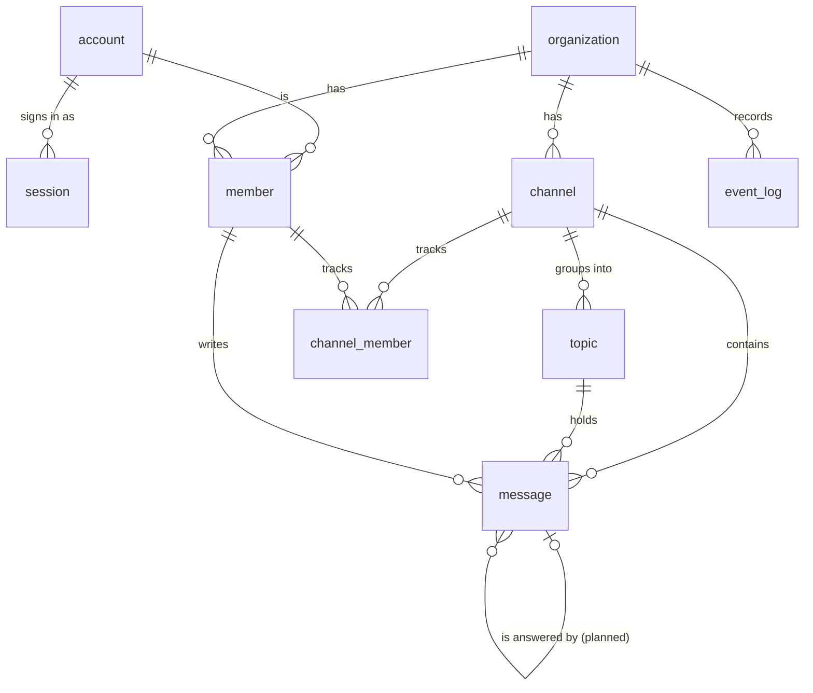

# Entities

The things ribbitto stores and how they relate. Terms are in the
[glossary](README.md#glossary); the rules that must always hold are in
[`invariants.md`](invariants.md).

**Keep it current:** update this file in the same pull request whenever an
entity or a relation changes. Entities marked *planned* do not have tables
yet; `db/migrations/` is the source of truth for what exists. See the
[generated schema reference](../schema/README.md) for the current tables,
columns and constraints.

| Entity | Status | Key columns |
|---|---|---|
| `organization` | exists | `id` (UUIDv7), `slug` (1–63 chars, `a-z0-9-`, no leading or trailing `-`), `name`, `event_seq`, `event_log_boundary_seq` |
| `account` | exists | normalised unique email, display name, Argon2id password hash |
| `session` | exists | SHA-256 hash of the session token, expiry |
| `setup` | exists | boolean key fixed to `true`, `organization_id`, `completed_at` |
| `member` | exists | `organization_id`, `account_id`, role (`owner` or `member`), `joined_event_seq`, `handle` (unique per organisation) |
| `channel` | exists | `id`, `organization_id`, `name`, `is_default`, `created_at`, `default_topic_id`, `default_topic_is_default` |
| `topic` | exists | `id`, `organization_id`, `channel_id`, `name` (NULL for the default topic), `is_default`, `created_at` ([`topics.md`](topics.md)) |
| `channel_member` | planned (M4) | `organization_id`, `channel_id`, `member_id`, `last_read_event_seq` |
| `message` | exists | `id`, `organization_id`, `channel_id`, `topic_id`, `member_id`, `body`, `event_seq`, `created_at`; planned: nullable `reply_to_message_id` ([`replies.md`](replies.md)) |
| `event_log` | exists | `organization_id`, `seq` (composite key), `kind`, nullable `audience_member_id`, IDs-only `data`, `created_at` |

An event's NULL audience means organisation-wide; a non-NULL audience names
only that member, with a composite foreign key to the same organisation.
The audience is never in `data`; [payloads](../architecture/realtime.md#durable-event-log)
contain only channel/message IDs or the joining member ID, never bodies or HTML.
Both current kinds are organisation-wide. `realtime.Event` is their plain value type.

Except for the singleton setup key, all ids are UUIDv7, generated by
PostgreSQL's `uuidv7()`, so they sort by creation time.

Channels are identified by `id`, never by name, and every member may create
one. **Every organisation has exactly one default channel**: a partial unique
index allows at most one, first-run setup and a backfill migration create at
least one, and M2 offers no way to delete a channel or clear `is_default`, so
it never drops to zero ([`channels.md`](channels.md)).
