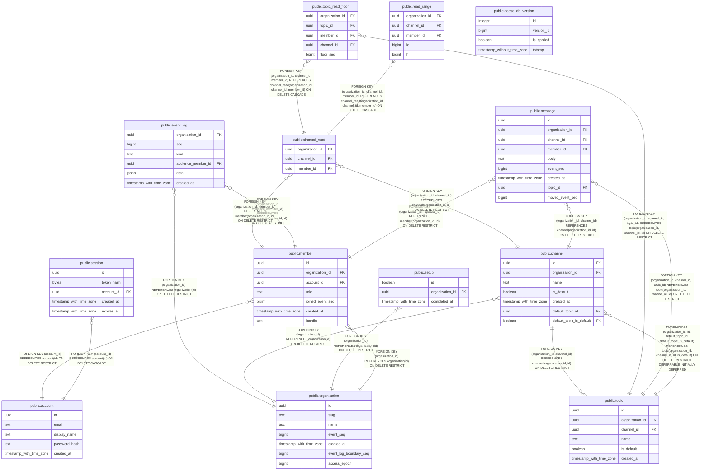

# ribbitto

## Tables

| Name | Columns | Comment | Type |
| ---- | ------- | ------- | ---- |
| [public.goose_db_version](public.goose_db_version.md) | 4 |  | BASE TABLE |
| [public.organization](public.organization.md) | 7 |  | BASE TABLE |
| [public.account](public.account.md) | 5 |  | BASE TABLE |
| [public.session](public.session.md) | 5 |  | BASE TABLE |
| [public.member](public.member.md) | 7 |  | BASE TABLE |
| [public.setup](public.setup.md) | 3 |  | BASE TABLE |
| [public.channel](public.channel.md) | 7 |  | BASE TABLE |
| [public.message](public.message.md) | 9 |  | BASE TABLE |
| [public.event_log](public.event_log.md) | 6 |  | BASE TABLE |
| [public.topic](public.topic.md) | 6 |  | BASE TABLE |
| [public.channel_read](public.channel_read.md) | 3 |  | BASE TABLE |
| [public.read_range](public.read_range.md) | 5 |  | BASE TABLE |
| [public.topic_read_floor](public.topic_read_floor.md) | 5 |  | BASE TABLE |

## Stored procedures and functions

| Name | ReturnType | Arguments | Type |
| ---- | ------- | ------- | ---- |
| public.organization_event_seq_logged | trigger |  | FUNCTION |
| public.organization_access_guard | trigger |  | FUNCTION |
| public.member_access_changed | trigger |  | FUNCTION |
| public.member_access_truncated | trigger |  | FUNCTION |

## Relations

```mermaid
erDiagram

"public.session" }o--|| "public.account" : "FOREIGN KEY (account_id) REFERENCES account(id) ON DELETE CASCADE"
"public.member" }o--|| "public.organization" : "FOREIGN KEY (organization_id) REFERENCES organization(id) ON DELETE RESTRICT"
"public.member" }o--|| "public.account" : "FOREIGN KEY (account_id) REFERENCES account(id) ON DELETE RESTRICT"
"public.setup" }o--|| "public.organization" : "FOREIGN KEY (organization_id) REFERENCES organization(id) ON DELETE RESTRICT"
"public.channel" }o--|| "public.organization" : "FOREIGN KEY (organization_id) REFERENCES organization(id) ON DELETE RESTRICT"
"public.channel" }o--|| "public.topic" : "FOREIGN KEY (organization_id, id, default_topic_id, default_topic_is_default) REFERENCES topic(organization_id, channel_id, id, is_default) ON DELETE RESTRICT DEFERRABLE INITIALLY DEFERRED"
"public.message" }o--|| "public.member" : "FOREIGN KEY (organization_id, member_id) REFERENCES member(organization_id, id) ON DELETE RESTRICT"
"public.message" }o--|| "public.channel" : "FOREIGN KEY (organization_id, channel_id) REFERENCES channel(organization_id, id) ON DELETE RESTRICT"
"public.message" }o--|| "public.topic" : "FOREIGN KEY (organization_id, channel_id, topic_id) REFERENCES topic(organization_id, channel_id, id) ON DELETE RESTRICT"
"public.event_log" }o--|| "public.organization" : "FOREIGN KEY (organization_id) REFERENCES organization(id) ON DELETE RESTRICT"
"public.event_log" }o--|| "public.member" : "FOREIGN KEY (organization_id, audience_member_id) REFERENCES member(organization_id, id) ON DELETE RESTRICT"
"public.topic" }o--|| "public.channel" : "FOREIGN KEY (organization_id, channel_id) REFERENCES channel(organization_id, id) ON DELETE RESTRICT"
"public.channel_read" }o--|| "public.member" : "FOREIGN KEY (organization_id, member_id) REFERENCES member(organization_id, id) ON DELETE RESTRICT"
"public.channel_read" }o--|| "public.channel" : "FOREIGN KEY (organization_id, channel_id) REFERENCES channel(organization_id, id) ON DELETE RESTRICT"
"public.read_range" }o--|| "public.channel_read" : "FOREIGN KEY (organization_id, channel_id, member_id) REFERENCES channel_read(organization_id, channel_id, member_id) ON DELETE CASCADE"
"public.topic_read_floor" }o--|| "public.topic" : "FOREIGN KEY (organization_id, channel_id, topic_id) REFERENCES topic(organization_id, channel_id, id) ON DELETE RESTRICT"
"public.topic_read_floor" }o--|| "public.channel_read" : "FOREIGN KEY (organization_id, channel_id, member_id) REFERENCES channel_read(organization_id, channel_id, member_id) ON DELETE CASCADE"

"public.goose_db_version" {
  integer id
  bigint version_id
  boolean is_applied
  timestamp_without_time_zone tstamp
}
"public.organization" {
  uuid id
  text slug
  text name
  bigint event_seq
  timestamp_with_time_zone created_at
  bigint event_log_boundary_seq
  bigint access_epoch
}
"public.account" {
  uuid id
  text email
  text display_name
  text password_hash
  timestamp_with_time_zone created_at
}
"public.session" {
  uuid id
  bytea token_hash
  uuid account_id FK
  timestamp_with_time_zone created_at
  timestamp_with_time_zone expires_at
}
"public.member" {
  uuid id
  uuid organization_id FK
  uuid account_id FK
  text role
  bigint joined_event_seq
  timestamp_with_time_zone created_at
  text handle
}
"public.setup" {
  boolean id
  uuid organization_id FK
  timestamp_with_time_zone completed_at
}
"public.channel" {
  uuid id FK
  uuid organization_id FK
  text name
  boolean is_default
  timestamp_with_time_zone created_at
  uuid default_topic_id FK
  boolean default_topic_is_default FK
}
"public.message" {
  uuid id
  uuid organization_id FK
  uuid channel_id FK
  uuid member_id FK
  text body
  bigint event_seq
  timestamp_with_time_zone created_at
  uuid topic_id FK
  bigint moved_event_seq
}
"public.event_log" {
  uuid organization_id FK
  bigint seq
  text kind
  uuid audience_member_id FK
  jsonb data
  timestamp_with_time_zone created_at
}
"public.topic" {
  uuid id
  uuid organization_id FK
  uuid channel_id FK
  text name
  boolean is_default
  timestamp_with_time_zone created_at
}
"public.channel_read" {
  uuid organization_id FK
  uuid channel_id FK
  uuid member_id FK
}
"public.read_range" {
  uuid organization_id FK
  uuid channel_id FK
  uuid member_id FK
  bigint lo
  bigint hi
}
"public.topic_read_floor" {
  uuid organization_id FK
  uuid topic_id FK
  uuid member_id FK
  uuid channel_id FK
  bigint floor_seq
}
```

---

> Generated by [tbls](https://github.com/k1LoW/tbls)
