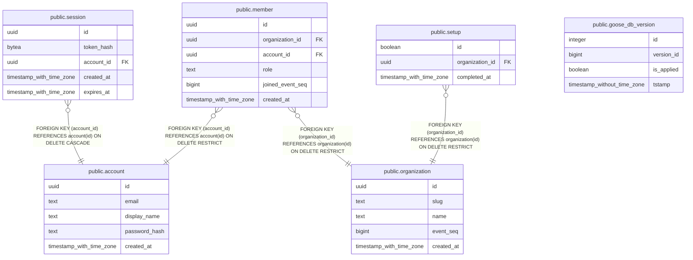

# ribbitto

## Tables

| Name | Columns | Comment | Type |
| ---- | ------- | ------- | ---- |
| [public.goose_db_version](public.goose_db_version.md) | 4 |  | BASE TABLE |
| [public.organization](public.organization.md) | 5 |  | BASE TABLE |
| [public.account](public.account.md) | 5 |  | BASE TABLE |
| [public.session](public.session.md) | 5 |  | BASE TABLE |
| [public.member](public.member.md) | 6 |  | BASE TABLE |
| [public.setup](public.setup.md) | 3 |  | BASE TABLE |

## Relations

```mermaid
erDiagram

"public.session" }o--|| "public.account" : "FOREIGN KEY (account_id) REFERENCES account(id) ON DELETE CASCADE"
"public.member" }o--|| "public.organization" : "FOREIGN KEY (organization_id) REFERENCES organization(id) ON DELETE RESTRICT"
"public.member" }o--|| "public.account" : "FOREIGN KEY (account_id) REFERENCES account(id) ON DELETE RESTRICT"
"public.setup" }o--|| "public.organization" : "FOREIGN KEY (organization_id) REFERENCES organization(id) ON DELETE RESTRICT"

"public.goose_db_version" {
  integer id
  bigint version_id
  boolean is_applied
  timestamp_without_time_zone tstamp
}
"public.organization" {
  uuid id
  text slug
  text name
  bigint event_seq
  timestamp_with_time_zone created_at
}
"public.account" {
  uuid id
  text email
  text display_name
  text password_hash
  timestamp_with_time_zone created_at
}
"public.session" {
  uuid id
  bytea token_hash
  uuid account_id FK
  timestamp_with_time_zone created_at
  timestamp_with_time_zone expires_at
}
"public.member" {
  uuid id
  uuid organization_id FK
  uuid account_id FK
  text role
  bigint joined_event_seq
  timestamp_with_time_zone created_at
}
"public.setup" {
  boolean id
  uuid organization_id FK
  timestamp_with_time_zone completed_at
}
```

---

> Generated by [tbls](https://github.com/k1LoW/tbls)
