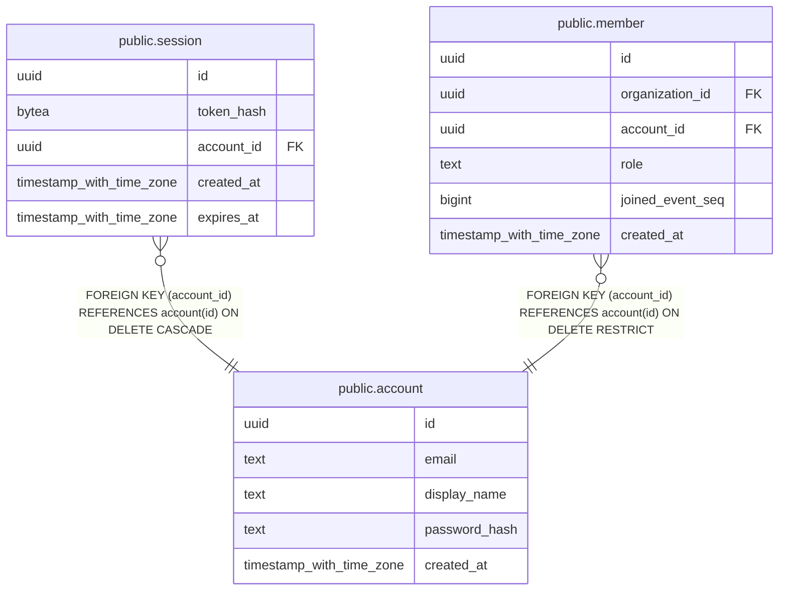

# public.account

## Columns

| Name | Type | Default | Nullable | Children | Parents | Comment |
| ---- | ---- | ------- | -------- | -------- | ------- | ------- |
| id | uuid | uuidv7() | false | [public.session](public.session.md) [public.member](public.member.md) |  |  |
| email | text |  | false |  |  |  |
| display_name | text |  | false |  |  |  |
| password_hash | text |  | false |  |  |  |
| created_at | timestamp with time zone | now() | false |  |  |  |

## Constraints

| Name | Type | Definition |
| ---- | ---- | ---------- |
| account_created_at_not_null | n | NOT NULL created_at |
| account_display_name_check | CHECK | CHECK (((length(display_name) >= 1) AND (length(display_name) <= 50))) |
| account_display_name_not_null | n | NOT NULL display_name |
| account_email_check | CHECK | CHECK (((email = lower(email)) AND (octet_length(email) <= 254))) |
| account_email_not_null | n | NOT NULL email |
| account_id_not_null | n | NOT NULL id |
| account_password_hash_check | CHECK | CHECK (starts_with(password_hash, '$argon2id$'::text)) |
| account_password_hash_not_null | n | NOT NULL password_hash |
| account_pkey | PRIMARY KEY | PRIMARY KEY (id) |
| account_email_key | UNIQUE | UNIQUE (email) |

## Indexes

| Name | Definition |
| ---- | ---------- |
| account_pkey | CREATE UNIQUE INDEX account_pkey ON public.account USING btree (id) |
| account_email_key | CREATE UNIQUE INDEX account_email_key ON public.account USING btree (email) |

## Relations

---

> Generated by [tbls](https://github.com/k1LoW/tbls)
