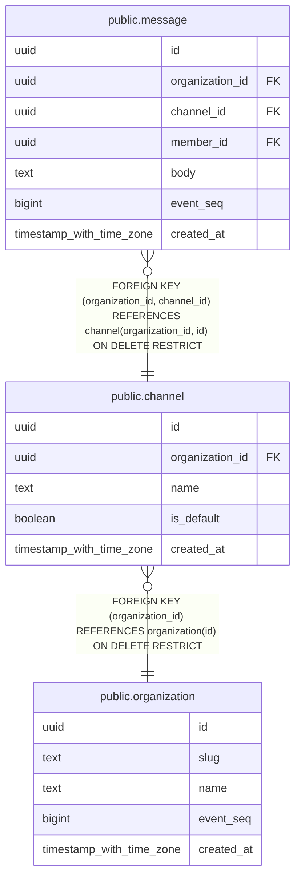

# public.channel

## Columns

| Name | Type | Default | Nullable | Children | Parents | Comment |
| ---- | ---- | ------- | -------- | -------- | ------- | ------- |
| id | uuid | uuidv7() | false | [public.message](public.message.md) |  |  |
| organization_id | uuid |  | false | [public.message](public.message.md) | [public.organization](public.organization.md) |  |
| name | text |  | false |  |  |  |
| is_default | boolean | false | false |  |  |  |
| created_at | timestamp with time zone | now() | false |  |  |  |

## Constraints

| Name | Type | Definition |
| ---- | ---- | ---------- |
| channel_created_at_not_null | n | NOT NULL created_at |
| channel_id_not_null | n | NOT NULL id |
| channel_is_default_not_null | n | NOT NULL is_default |
| channel_name_check | CHECK | CHECK (((length(name) >= 1) AND (length(name) <= 80))) |
| channel_name_check1 | CHECK | CHECK ((name = NORMALIZE(name, NFC))) |
| channel_name_not_null | n | NOT NULL name |
| channel_organization_id_not_null | n | NOT NULL organization_id |
| channel_organization_id_fkey | FOREIGN KEY | FOREIGN KEY (organization_id) REFERENCES organization(id) ON DELETE RESTRICT |
| channel_pkey | PRIMARY KEY | PRIMARY KEY (id) |
| channel_organization_id_name_key | UNIQUE | UNIQUE (organization_id, name) |
| channel_organization_id_id_key | UNIQUE | UNIQUE (organization_id, id) |

## Indexes

| Name | Definition |
| ---- | ---------- |
| channel_pkey | CREATE UNIQUE INDEX channel_pkey ON public.channel USING btree (id) |
| channel_organization_id_name_key | CREATE UNIQUE INDEX channel_organization_id_name_key ON public.channel USING btree (organization_id, name) |
| channel_organization_id_id_key | CREATE UNIQUE INDEX channel_organization_id_id_key ON public.channel USING btree (organization_id, id) |
| channel_default_idx | CREATE UNIQUE INDEX channel_default_idx ON public.channel USING btree (organization_id) WHERE is_default |

## Relations

---

> Generated by [tbls](https://github.com/k1LoW/tbls)
