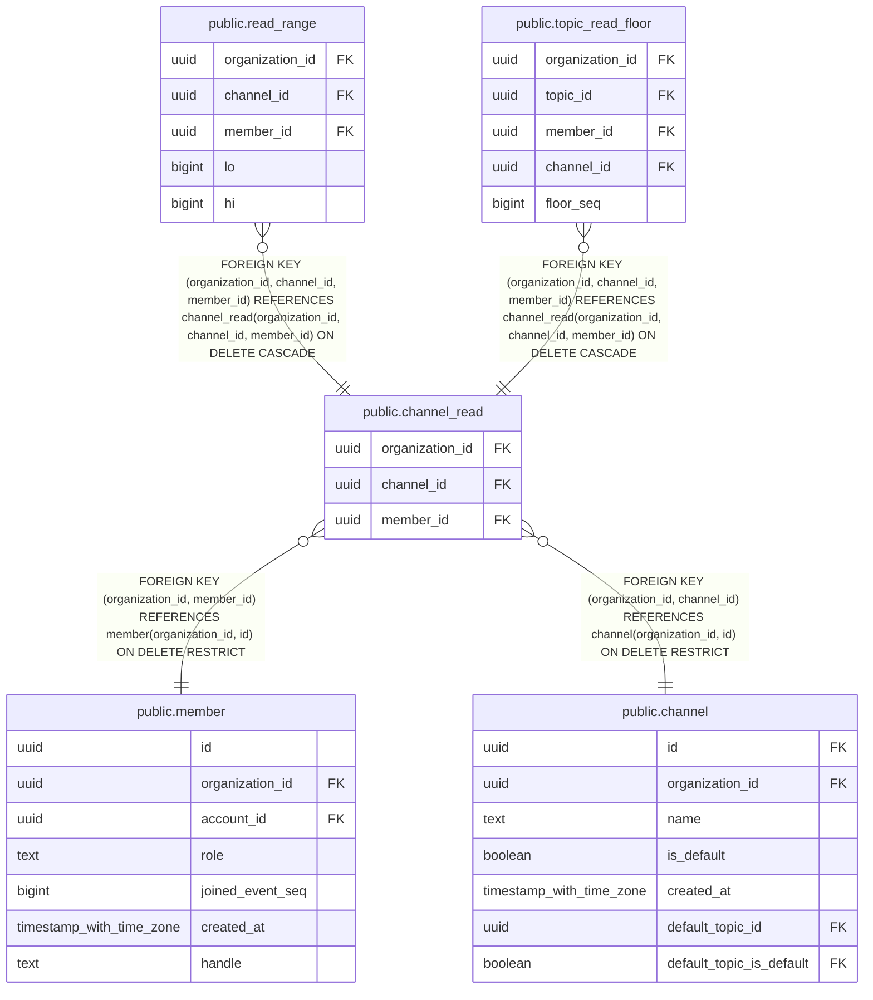

# public.channel_read

## Columns

| Name | Type | Default | Nullable | Children | Parents | Comment |
| ---- | ---- | ------- | -------- | -------- | ------- | ------- |
| organization_id | uuid |  | false | [public.read_range](public.read_range.md) [public.topic_read_floor](public.topic_read_floor.md) | [public.member](public.member.md) [public.channel](public.channel.md) |  |
| channel_id | uuid |  | false | [public.read_range](public.read_range.md) [public.topic_read_floor](public.topic_read_floor.md) | [public.channel](public.channel.md) |  |
| member_id | uuid |  | false | [public.read_range](public.read_range.md) [public.topic_read_floor](public.topic_read_floor.md) | [public.member](public.member.md) |  |

## Constraints

| Name | Type | Definition |
| ---- | ---- | ---------- |
| channel_read_channel_id_not_null | n | NOT NULL channel_id |
| channel_read_member_id_not_null | n | NOT NULL member_id |
| channel_read_organization_id_not_null | n | NOT NULL organization_id |
| channel_read_organization_id_member_id_fkey | FOREIGN KEY | FOREIGN KEY (organization_id, member_id) REFERENCES member(organization_id, id) ON DELETE RESTRICT |
| channel_read_organization_id_channel_id_fkey | FOREIGN KEY | FOREIGN KEY (organization_id, channel_id) REFERENCES channel(organization_id, id) ON DELETE RESTRICT |
| channel_read_pkey | PRIMARY KEY | PRIMARY KEY (organization_id, channel_id, member_id) |

## Indexes

| Name | Definition |
| ---- | ---------- |
| channel_read_pkey | CREATE UNIQUE INDEX channel_read_pkey ON public.channel_read USING btree (organization_id, channel_id, member_id) |

## Relations

---

> Generated by [tbls](https://github.com/k1LoW/tbls)
