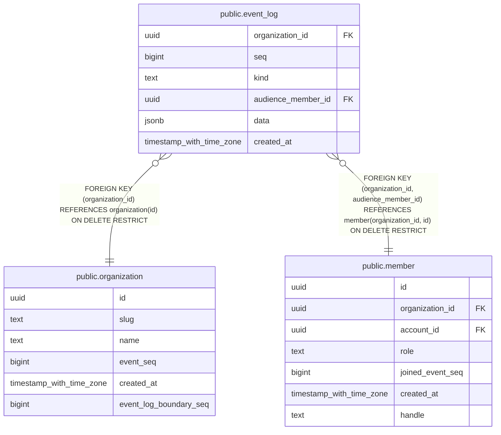

# public.event_log

## Columns

| Name | Type | Default | Nullable | Children | Parents | Comment |
| ---- | ---- | ------- | -------- | -------- | ------- | ------- |
| organization_id | uuid |  | false |  | [public.organization](public.organization.md) [public.member](public.member.md) |  |
| seq | bigint |  | false |  |  |  |
| kind | text |  | false |  |  |  |
| audience_member_id | uuid |  | true |  | [public.member](public.member.md) |  |
| data | jsonb |  | false |  |  |  |
| created_at | timestamp with time zone | now() | false |  |  |  |

## Constraints

| Name | Type | Definition |
| ---- | ---- | ---------- |
| event_log_created_at_not_null | n | NOT NULL created_at |
| event_log_data_not_null | n | NOT NULL data |
| event_log_kind_not_null | n | NOT NULL kind |
| event_log_organization_id_not_null | n | NOT NULL organization_id |
| event_log_seq_check | CHECK | CHECK ((seq >= 1)) |
| event_log_seq_not_null | n | NOT NULL seq |
| event_log_organization_id_fkey | FOREIGN KEY | FOREIGN KEY (organization_id) REFERENCES organization(id) ON DELETE RESTRICT |
| event_log_organization_id_audience_member_id_fkey | FOREIGN KEY | FOREIGN KEY (organization_id, audience_member_id) REFERENCES member(organization_id, id) ON DELETE RESTRICT |
| event_log_pkey | PRIMARY KEY | PRIMARY KEY (organization_id, seq) |

## Indexes

| Name | Definition |
| ---- | ---------- |
| event_log_pkey | CREATE UNIQUE INDEX event_log_pkey ON public.event_log USING btree (organization_id, seq) |

## Relations

---

> Generated by [tbls](https://github.com/k1LoW/tbls)
