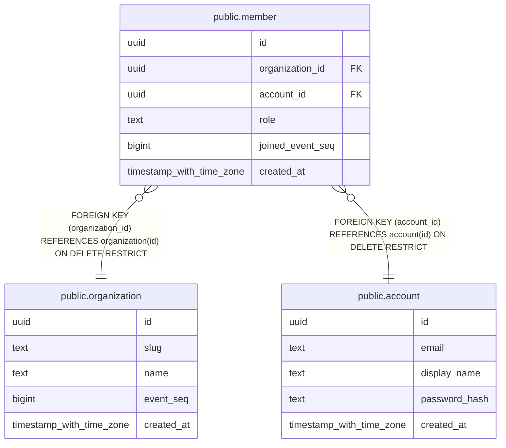

# public.member

## Columns

| Name | Type | Default | Nullable | Children | Parents | Comment |
| ---- | ---- | ------- | -------- | -------- | ------- | ------- |
| id | uuid | uuidv7() | false |  |  |  |
| organization_id | uuid |  | false |  | [public.organization](public.organization.md) |  |
| account_id | uuid |  | false |  | [public.account](public.account.md) |  |
| role | text |  | false |  |  |  |
| joined_event_seq | bigint |  | false |  |  |  |
| created_at | timestamp with time zone | now() | false |  |  |  |

## Constraints

| Name | Type | Definition |
| ---- | ---- | ---------- |
| member_account_id_not_null | n | NOT NULL account_id |
| member_created_at_not_null | n | NOT NULL created_at |
| member_id_not_null | n | NOT NULL id |
| member_joined_event_seq_check | CHECK | CHECK ((joined_event_seq >= 1)) |
| member_joined_event_seq_not_null | n | NOT NULL joined_event_seq |
| member_organization_id_not_null | n | NOT NULL organization_id |
| member_role_check | CHECK | CHECK ((role = ANY (ARRAY['owner'::text, 'member'::text]))) |
| member_role_not_null | n | NOT NULL role |
| member_organization_id_fkey | FOREIGN KEY | FOREIGN KEY (organization_id) REFERENCES organization(id) ON DELETE RESTRICT |
| member_account_id_fkey | FOREIGN KEY | FOREIGN KEY (account_id) REFERENCES account(id) ON DELETE RESTRICT |
| member_pkey | PRIMARY KEY | PRIMARY KEY (id) |
| member_organization_id_account_id_key | UNIQUE | UNIQUE (organization_id, account_id) |
| member_organization_id_id_key | UNIQUE | UNIQUE (organization_id, id) |

## Indexes

| Name | Definition |
| ---- | ---------- |
| member_pkey | CREATE UNIQUE INDEX member_pkey ON public.member USING btree (id) |
| member_organization_id_account_id_key | CREATE UNIQUE INDEX member_organization_id_account_id_key ON public.member USING btree (organization_id, account_id) |
| member_organization_id_id_key | CREATE UNIQUE INDEX member_organization_id_id_key ON public.member USING btree (organization_id, id) |

## Relations

---

> Generated by [tbls](https://github.com/k1LoW/tbls)
