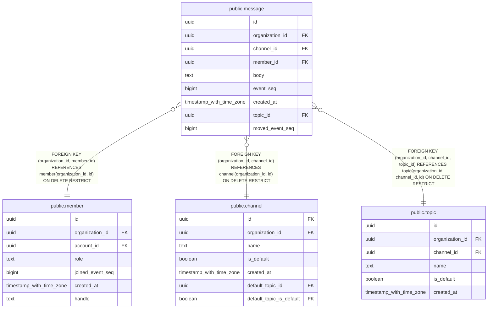

# public.message

## Columns

| Name | Type | Default | Nullable | Children | Parents | Comment |
| ---- | ---- | ------- | -------- | -------- | ------- | ------- |
| id | uuid | uuidv7() | false |  |  |  |
| organization_id | uuid |  | false |  | [public.member](public.member.md) [public.channel](public.channel.md) [public.topic](public.topic.md) |  |
| channel_id | uuid |  | false |  | [public.channel](public.channel.md) [public.topic](public.topic.md) |  |
| member_id | uuid |  | false |  | [public.member](public.member.md) |  |
| body | text |  | false |  |  |  |
| event_seq | bigint |  | false |  |  |  |
| created_at | timestamp with time zone | now() | false |  |  |  |
| topic_id | uuid |  | false |  | [public.topic](public.topic.md) |  |
| moved_event_seq | bigint |  | true |  |  |  |

## Constraints

| Name | Type | Definition |
| ---- | ---- | ---------- |
| message_body_check | CHECK | CHECK (((length(body) >= 1) AND (length(body) <= 4000))) |
| message_body_check1 | CHECK | CHECK ((body !~ '[---Ÿ

‪‫‬‭‮]'::text)) |
| message_body_check2 | CHECK | CHECK ((body = btrim(body, '	   '::text))) |
| message_body_not_null | n | NOT NULL body |
| message_channel_id_not_null | n | NOT NULL channel_id |
| message_created_at_not_null | n | NOT NULL created_at |
| message_event_seq_check | CHECK | CHECK ((event_seq >= 1)) |
| message_event_seq_not_null | n | NOT NULL event_seq |
| message_id_not_null | n | NOT NULL id |
| message_member_id_not_null | n | NOT NULL member_id |
| message_organization_id_not_null | n | NOT NULL organization_id |
| message_topic_id_not_null | n | NOT NULL topic_id |
| message_organization_id_member_id_fkey | FOREIGN KEY | FOREIGN KEY (organization_id, member_id) REFERENCES member(organization_id, id) ON DELETE RESTRICT |
| message_organization_id_channel_id_fkey | FOREIGN KEY | FOREIGN KEY (organization_id, channel_id) REFERENCES channel(organization_id, id) ON DELETE RESTRICT |
| message_pkey | PRIMARY KEY | PRIMARY KEY (id) |
| message_organization_id_event_seq_key | UNIQUE | UNIQUE (organization_id, event_seq) |
| message_topic_fkey | FOREIGN KEY | FOREIGN KEY (organization_id, channel_id, topic_id) REFERENCES topic(organization_id, channel_id, id) ON DELETE RESTRICT |

## Indexes

| Name | Definition |
| ---- | ---------- |
| message_pkey | CREATE UNIQUE INDEX message_pkey ON public.message USING btree (id) |
| message_organization_id_event_seq_key | CREATE UNIQUE INDEX message_organization_id_event_seq_key ON public.message USING btree (organization_id, event_seq) |
| message_channel_event_seq_idx | CREATE INDEX message_channel_event_seq_idx ON public.message USING btree (organization_id, channel_id, event_seq) |
| message_topic_event_seq_idx | CREATE INDEX message_topic_event_seq_idx ON public.message USING btree (organization_id, topic_id, event_seq) |
| message_moved_event_seq_idx | CREATE INDEX message_moved_event_seq_idx ON public.message USING btree (organization_id, topic_id, moved_event_seq) WHERE (moved_event_seq IS NOT NULL) |

## Relations

---

> Generated by [tbls](https://github.com/k1LoW/tbls)
