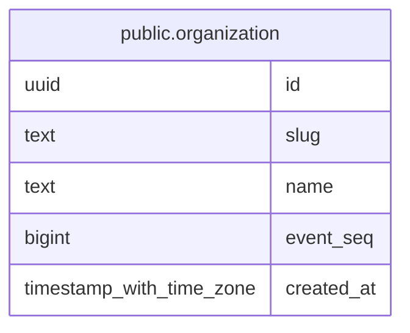

# public.organization

## Columns

| Name | Type | Default | Nullable | Children | Parents | Comment |
| ---- | ---- | ------- | -------- | -------- | ------- | ------- |
| id | uuid | uuidv7() | false |  |  |  |
| slug | text |  | false |  |  |  |
| name | text |  | false |  |  |  |
| event_seq | bigint | 0 | false |  |  |  |
| created_at | timestamp with time zone | now() | false |  |  |  |

## Constraints

| Name | Type | Definition |
| ---- | ---- | ---------- |
| organization_created_at_not_null | n | NOT NULL created_at |
| organization_event_seq_check | CHECK | CHECK ((event_seq >= 0)) |
| organization_event_seq_not_null | n | NOT NULL event_seq |
| organization_id_not_null | n | NOT NULL id |
| organization_name_check | CHECK | CHECK (((length(name) >= 1) AND (length(name) <= 100))) |
| organization_name_not_null | n | NOT NULL name |
| organization_slug_check | CHECK | CHECK ((slug ~ '^[a-z0-9]([a-z0-9-]{0,61}[a-z0-9])?$'::text)) |
| organization_slug_not_null | n | NOT NULL slug |
| organization_pkey | PRIMARY KEY | PRIMARY KEY (id) |
| organization_slug_key | UNIQUE | UNIQUE (slug) |

## Indexes

| Name | Definition |
| ---- | ---------- |
| organization_pkey | CREATE UNIQUE INDEX organization_pkey ON public.organization USING btree (id) |
| organization_slug_key | CREATE UNIQUE INDEX organization_slug_key ON public.organization USING btree (slug) |

## Relations

---

> Generated by [tbls](https://github.com/k1LoW/tbls)
