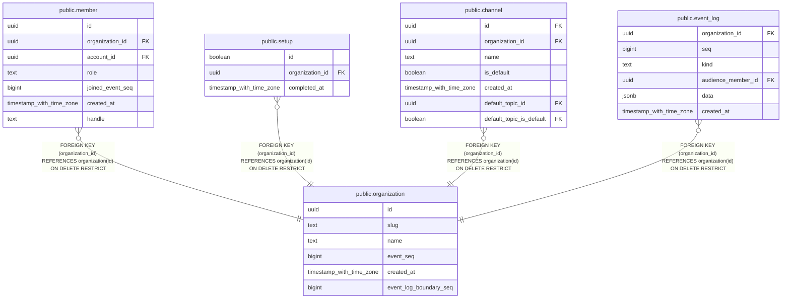

# public.organization

## Columns

| Name | Type | Default | Nullable | Children | Parents | Comment |
| ---- | ---- | ------- | -------- | -------- | ------- | ------- |
| id | uuid | uuidv7() | false | [public.member](public.member.md) [public.setup](public.setup.md) [public.channel](public.channel.md) [public.event_log](public.event_log.md) |  |  |
| slug | text |  | false |  |  |  |
| name | text |  | false |  |  |  |
| event_seq | bigint | 0 | false |  |  |  |
| created_at | timestamp with time zone | now() | false |  |  |  |
| event_log_boundary_seq | bigint | 0 | false |  |  |  |

## Constraints

| Name | Type | Definition |
| ---- | ---- | ---------- |
| organization_created_at_not_null | n | NOT NULL created_at |
| organization_event_log_boundary_seq_not_null | n | NOT NULL event_log_boundary_seq |
| organization_event_seq_check | CHECK | CHECK ((event_seq >= 0)) |
| organization_event_seq_logged | TRIGGER | CREATE CONSTRAINT TRIGGER organization_event_seq_logged AFTER UPDATE OF event_seq ON public.organization DEFERRABLE INITIALLY DEFERRED FOR EACH ROW EXECUTE FUNCTION organization_event_seq_logged() |
| organization_event_seq_not_null | n | NOT NULL event_seq |
| organization_id_not_null | n | NOT NULL id |
| organization_name_check | CHECK | CHECK (((length(name) >= 1) AND (length(name) <= 100))) |
| organization_name_not_null | n | NOT NULL name |
| organization_slug_check | CHECK | CHECK ((slug ~ '^[a-z0-9]([a-z0-9-]{0,61}[a-z0-9])?$'::text)) |
| organization_slug_not_null | n | NOT NULL slug |
| organization_pkey | PRIMARY KEY | PRIMARY KEY (id) |
| organization_slug_key | UNIQUE | UNIQUE (slug) |

## Indexes

| Name | Definition |
| ---- | ---------- |
| organization_pkey | CREATE UNIQUE INDEX organization_pkey ON public.organization USING btree (id) |
| organization_slug_key | CREATE UNIQUE INDEX organization_slug_key ON public.organization USING btree (slug) |

## Triggers

| Name | Definition |
| ---- | ---------- |
| organization_event_seq_logged | CREATE CONSTRAINT TRIGGER organization_event_seq_logged AFTER UPDATE OF event_seq ON public.organization DEFERRABLE INITIALLY DEFERRED FOR EACH ROW EXECUTE FUNCTION organization_event_seq_logged() |

## Relations

```mermaid
erDiagram

"public.member" }o--|| "public.organization" : "FOREIGN KEY (organization_id) REFERENCES organization(id) ON DELETE RESTRICT"
"public.setup" }o--|| "public.organization" : "FOREIGN KEY (organization_id) REFERENCES organization(id) ON DELETE RESTRICT"
"public.channel" }o--|| "public.organization" : "FOREIGN KEY (organization_id) REFERENCES organization(id) ON DELETE RESTRICT"
"public.event_log" }o--|| "public.organization" : "FOREIGN KEY (organization_id) REFERENCES organization(id) ON DELETE RESTRICT"

"public.organization" {
  uuid id
  text slug
  text name
  bigint event_seq
  timestamp_with_time_zone created_at
  bigint event_log_boundary_seq
}
"public.member" {
  uuid id
  uuid organization_id FK
  uuid account_id FK
  text role
  bigint joined_event_seq
  timestamp_with_time_zone created_at
  text handle
}
"public.setup" {
  boolean id
  uuid organization_id FK
  timestamp_with_time_zone completed_at
}
"public.channel" {
  uuid id FK
  uuid organization_id FK
  text name
  boolean is_default
  timestamp_with_time_zone created_at
  uuid default_topic_id FK
  boolean default_topic_is_default FK
}
"public.event_log" {
  uuid organization_id FK
  bigint seq
  text kind
  uuid audience_member_id FK
  jsonb data
  timestamp_with_time_zone created_at
}
```

---

> Generated by [tbls](https://github.com/k1LoW/tbls)
