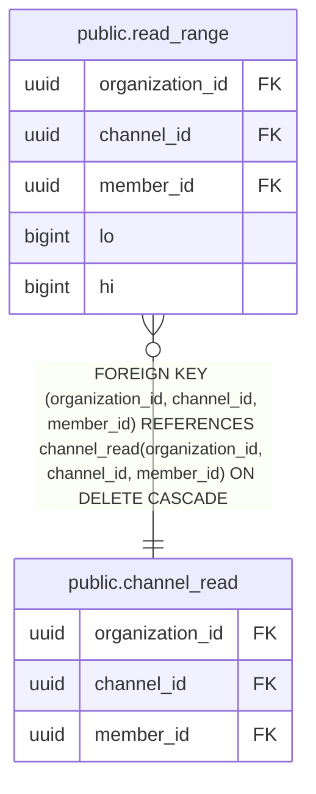

# public.read_range

## Columns

| Name | Type | Default | Nullable | Children | Parents | Comment |
| ---- | ---- | ------- | -------- | -------- | ------- | ------- |
| organization_id | uuid |  | false |  | [public.channel_read](public.channel_read.md) |  |
| channel_id | uuid |  | false |  | [public.channel_read](public.channel_read.md) |  |
| member_id | uuid |  | false |  | [public.channel_read](public.channel_read.md) |  |
| lo | bigint |  | false |  |  |  |
| hi | bigint |  | false |  |  |  |

## Constraints

| Name | Type | Definition |
| ---- | ---- | ---------- |
| read_range_channel_id_not_null | n | NOT NULL channel_id |
| read_range_check | CHECK | CHECK ((hi > lo)) |
| read_range_hi_not_null | n | NOT NULL hi |
| read_range_lo_check | CHECK | CHECK ((lo >= 0)) |
| read_range_lo_not_null | n | NOT NULL lo |
| read_range_member_id_not_null | n | NOT NULL member_id |
| read_range_organization_id_not_null | n | NOT NULL organization_id |
| read_range_organization_id_channel_id_member_id_fkey | FOREIGN KEY | FOREIGN KEY (organization_id, channel_id, member_id) REFERENCES channel_read(organization_id, channel_id, member_id) ON DELETE CASCADE |
| read_range_pkey | PRIMARY KEY | PRIMARY KEY (organization_id, channel_id, member_id, lo) |

## Indexes

| Name | Definition |
| ---- | ---------- |
| read_range_pkey | CREATE UNIQUE INDEX read_range_pkey ON public.read_range USING btree (organization_id, channel_id, member_id, lo) |

## Relations

---

> Generated by [tbls](https://github.com/k1LoW/tbls)
