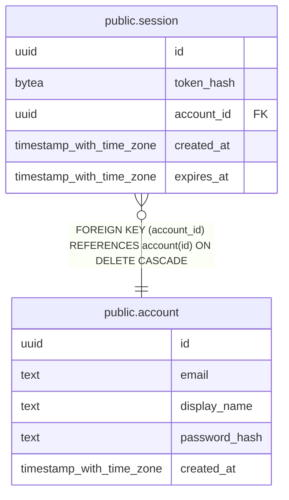

# public.session

## Columns

| Name | Type | Default | Nullable | Children | Parents | Comment |
| ---- | ---- | ------- | -------- | -------- | ------- | ------- |
| id | uuid | uuidv7() | false |  |  |  |
| token_hash | bytea |  | false |  |  |  |
| account_id | uuid |  | false |  | [public.account](public.account.md) |  |
| created_at | timestamp with time zone | now() | false |  |  |  |
| expires_at | timestamp with time zone |  | false |  |  |  |

## Constraints

| Name | Type | Definition |
| ---- | ---- | ---------- |
| session_account_id_not_null | n | NOT NULL account_id |
| session_check | CHECK | CHECK ((expires_at > created_at)) |
| session_created_at_not_null | n | NOT NULL created_at |
| session_expires_at_not_null | n | NOT NULL expires_at |
| session_id_not_null | n | NOT NULL id |
| session_token_hash_check | CHECK | CHECK ((octet_length(token_hash) = 32)) |
| session_token_hash_not_null | n | NOT NULL token_hash |
| session_account_id_fkey | FOREIGN KEY | FOREIGN KEY (account_id) REFERENCES account(id) ON DELETE CASCADE |
| session_pkey | PRIMARY KEY | PRIMARY KEY (id) |
| session_token_hash_key | UNIQUE | UNIQUE (token_hash) |

## Indexes

| Name | Definition |
| ---- | ---------- |
| session_pkey | CREATE UNIQUE INDEX session_pkey ON public.session USING btree (id) |
| session_token_hash_key | CREATE UNIQUE INDEX session_token_hash_key ON public.session USING btree (token_hash) |
| session_account_id_idx | CREATE INDEX session_account_id_idx ON public.session USING btree (account_id) |
| session_expires_at_idx | CREATE INDEX session_expires_at_idx ON public.session USING btree (expires_at) |

## Relations

---

> Generated by [tbls](https://github.com/k1LoW/tbls)
