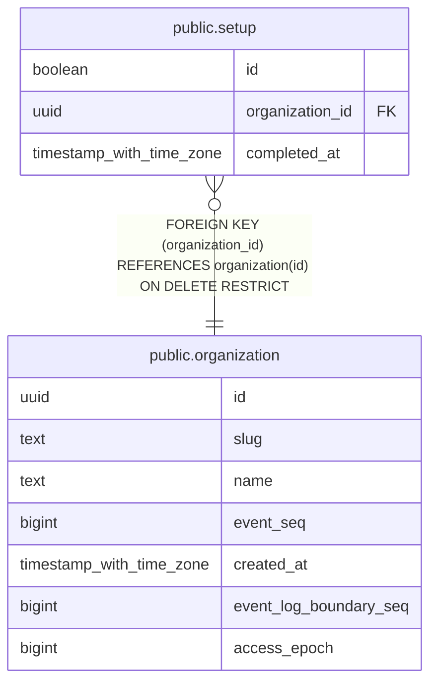

# public.setup

## Columns

| Name | Type | Default | Nullable | Children | Parents | Comment |
| ---- | ---- | ------- | -------- | -------- | ------- | ------- |
| id | boolean | true | false |  |  |  |
| organization_id | uuid |  | false |  | [public.organization](public.organization.md) |  |
| completed_at | timestamp with time zone | now() | false |  |  |  |

## Constraints

| Name | Type | Definition |
| ---- | ---- | ---------- |
| setup_completed_at_not_null | n | NOT NULL completed_at |
| setup_id_check | CHECK | CHECK (id) |
| setup_id_not_null | n | NOT NULL id |
| setup_organization_id_not_null | n | NOT NULL organization_id |
| setup_organization_id_fkey | FOREIGN KEY | FOREIGN KEY (organization_id) REFERENCES organization(id) ON DELETE RESTRICT |
| setup_pkey | PRIMARY KEY | PRIMARY KEY (id) |

## Indexes

| Name | Definition |
| ---- | ---------- |
| setup_pkey | CREATE UNIQUE INDEX setup_pkey ON public.setup USING btree (id) |

## Relations

---

> Generated by [tbls](https://github.com/k1LoW/tbls)
