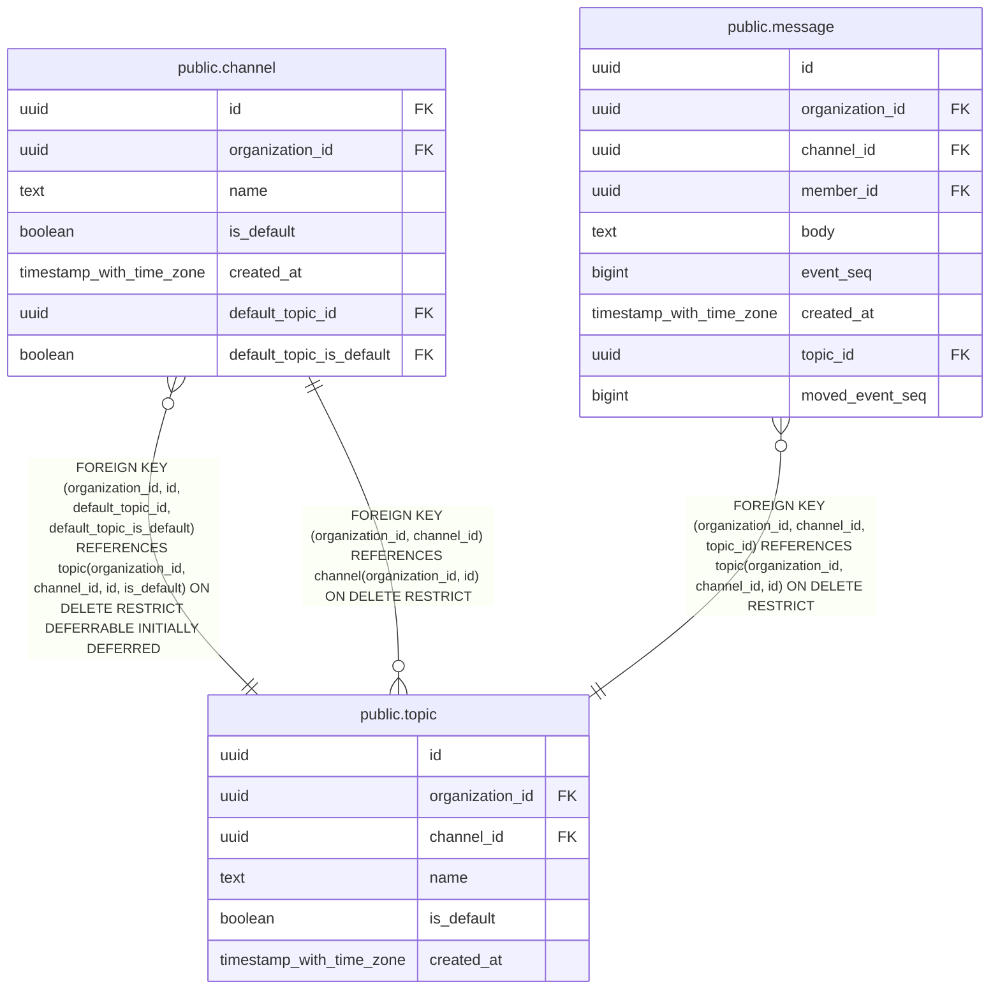

# public.topic

## Columns

| Name | Type | Default | Nullable | Children | Parents | Comment |
| ---- | ---- | ------- | -------- | -------- | ------- | ------- |
| id | uuid | uuidv7() | false | [public.channel](public.channel.md) [public.message](public.message.md) |  |  |
| organization_id | uuid |  | false | [public.channel](public.channel.md) [public.message](public.message.md) | [public.channel](public.channel.md) |  |
| channel_id | uuid |  | false | [public.channel](public.channel.md) [public.message](public.message.md) | [public.channel](public.channel.md) |  |
| name | text |  | true |  |  |  |
| is_default | boolean | false | false | [public.channel](public.channel.md) |  |  |
| created_at | timestamp with time zone | now() | false |  |  |  |

## Constraints

| Name | Type | Definition |
| ---- | ---- | ---------- |
| topic_channel_id_not_null | n | NOT NULL channel_id |
| topic_created_at_not_null | n | NOT NULL created_at |
| topic_default_unnamed_check | CHECK | CHECK ((is_default = (name IS NULL))) |
| topic_id_not_null | n | NOT NULL id |
| topic_is_default_not_null | n | NOT NULL is_default |
| topic_name_check | CHECK | CHECK ((((length(name) >= 1) AND (length(name) <= 80)) AND (name = NORMALIZE(name, NFC)))) |
| topic_organization_id_not_null | n | NOT NULL organization_id |
| topic_organization_id_channel_id_fkey | FOREIGN KEY | FOREIGN KEY (organization_id, channel_id) REFERENCES channel(organization_id, id) ON DELETE RESTRICT |
| topic_pkey | PRIMARY KEY | PRIMARY KEY (id) |
| topic_channel_id_key | UNIQUE | UNIQUE (organization_id, channel_id, id) |
| topic_channel_id_default_key | UNIQUE | UNIQUE (organization_id, channel_id, id, is_default) |

## Indexes

| Name | Definition |
| ---- | ---------- |
| topic_pkey | CREATE UNIQUE INDEX topic_pkey ON public.topic USING btree (id) |
| topic_channel_id_key | CREATE UNIQUE INDEX topic_channel_id_key ON public.topic USING btree (organization_id, channel_id, id) |
| topic_channel_id_default_key | CREATE UNIQUE INDEX topic_channel_id_default_key ON public.topic USING btree (organization_id, channel_id, id, is_default) |
| topic_default_idx | CREATE UNIQUE INDEX topic_default_idx ON public.topic USING btree (organization_id, channel_id) WHERE is_default |
| topic_name_idx | CREATE UNIQUE INDEX topic_name_idx ON public.topic USING btree (organization_id, channel_id, lower(name)) WHERE (name IS NOT NULL) |

## Relations

---

> Generated by [tbls](https://github.com/k1LoW/tbls)
