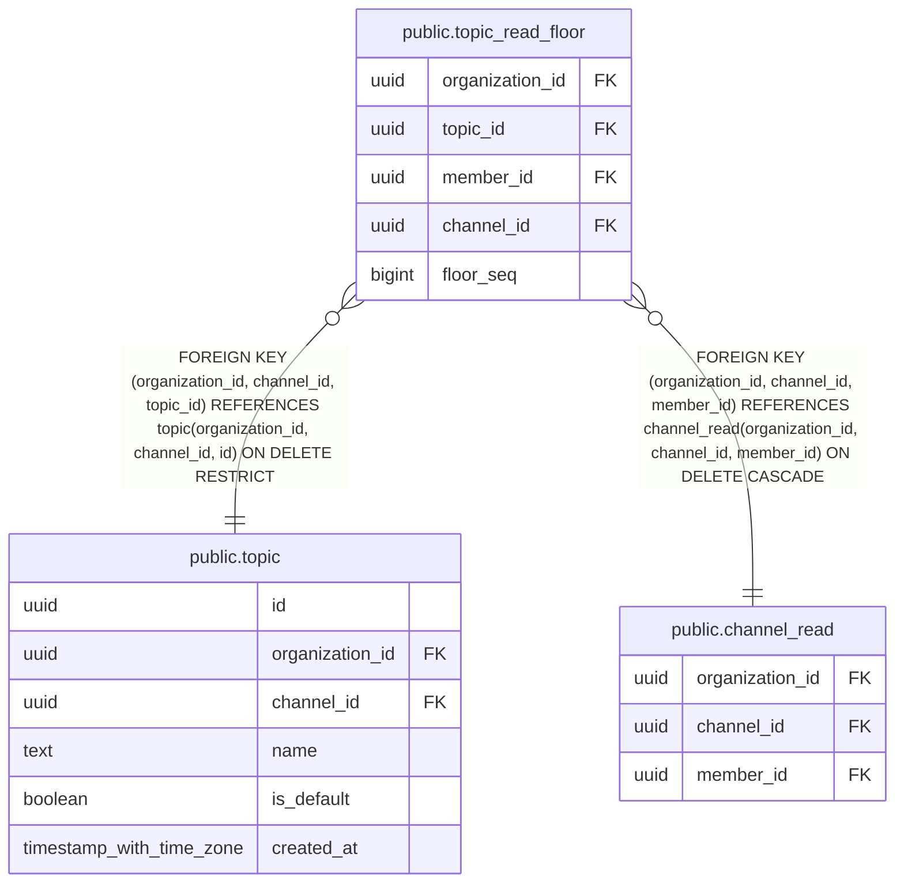

# public.topic_read_floor

## Columns

| Name | Type | Default | Nullable | Children | Parents | Comment |
| ---- | ---- | ------- | -------- | -------- | ------- | ------- |
| organization_id | uuid |  | false |  | [public.topic](public.topic.md) [public.channel_read](public.channel_read.md) |  |
| topic_id | uuid |  | false |  | [public.topic](public.topic.md) |  |
| member_id | uuid |  | false |  | [public.channel_read](public.channel_read.md) |  |
| channel_id | uuid |  | false |  | [public.topic](public.topic.md) [public.channel_read](public.channel_read.md) |  |
| floor_seq | bigint |  | false |  |  |  |

## Constraints

| Name | Type | Definition |
| ---- | ---- | ---------- |
| topic_read_floor_channel_id_not_null | n | NOT NULL channel_id |
| topic_read_floor_floor_seq_check | CHECK | CHECK ((floor_seq >= 0)) |
| topic_read_floor_floor_seq_not_null | n | NOT NULL floor_seq |
| topic_read_floor_member_id_not_null | n | NOT NULL member_id |
| topic_read_floor_organization_id_not_null | n | NOT NULL organization_id |
| topic_read_floor_topic_id_not_null | n | NOT NULL topic_id |
| topic_read_floor_organization_id_channel_id_topic_id_fkey | FOREIGN KEY | FOREIGN KEY (organization_id, channel_id, topic_id) REFERENCES topic(organization_id, channel_id, id) ON DELETE RESTRICT |
| topic_read_floor_organization_id_channel_id_member_id_fkey | FOREIGN KEY | FOREIGN KEY (organization_id, channel_id, member_id) REFERENCES channel_read(organization_id, channel_id, member_id) ON DELETE CASCADE |
| topic_read_floor_pkey | PRIMARY KEY | PRIMARY KEY (organization_id, topic_id, member_id) |

## Indexes

| Name | Definition |
| ---- | ---------- |
| topic_read_floor_pkey | CREATE UNIQUE INDEX topic_read_floor_pkey ON public.topic_read_floor USING btree (organization_id, topic_id, member_id) |

## Relations

---

> Generated by [tbls](https://github.com/k1LoW/tbls)
